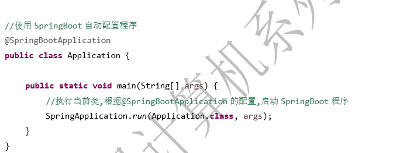
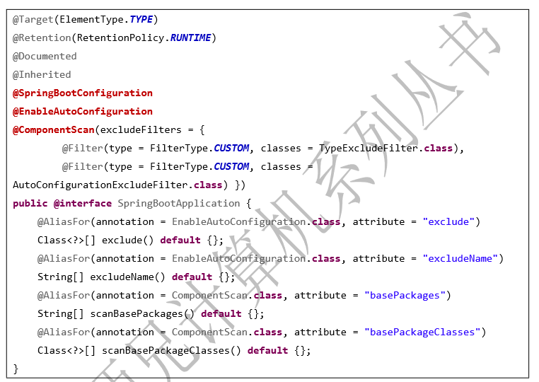

### 常用API说明
SpringApplication类:用于启动SpringBoot的程序，根据传入的类声明的注解来决定不同的启动方式

   
### @EnableAutoConfiguration注解
* 作用
  * 启动程序时，告诉SpringBoot启动对象使用SpringBoot的默认配置，只要在SpringBoot项目的入口类配置了@EnableAutoConfiguration，框架启动时就会根据导入的jar包来加载配置类，使用其默认配置
* 属性
  * exclude：使用class格式的方式，排除默认自启动中不需要的配置类
  * excludeName：使用类的限制名的方式，排除默认自动启动中不需要的配置类
            
### @SpringBootApplication注解

   
* 根据标红注解的声明，可以得出@SpringBootApplication注解包含三个功能：
  * @SpringBootConfiguration    加入了SpringBootApplication注解的类是一个配置类
  * @EnableAutoConfiguration    具备EnableAutoConfiguration注解启动SpringBootApplication默认配置类的功能
  * @ComponentScan    支持扫描当前类同包及子包的组件类创建bean在spring容器中
* 属性说明
  * basePackages：@SpringBootApplication注解默认扫描的是当前类的包及子包，如果要其他范围的包，可使用basepackages指定
  * basePackagesClass：用于精确指定哪些类需要创建对象到spring容器中
  * exclude：使用class的方式排除不扫描的类
  * excludeName：通过类的全限定名的方式，排除不扫描的类
        
### @ConfigurationBefore注解
指定在SpringBoot框架自动配置的配置类执行完成之前，执行指定的自定义配置类，如果放在Application入口类，表示在所有自动配置的配置类还没有加载就可以先加载自己的配置类
        
* 属性
  * value：使用类的方式指定自动配置类
  * name：使用类的全限定名（字符串）指定自动配置类
            
