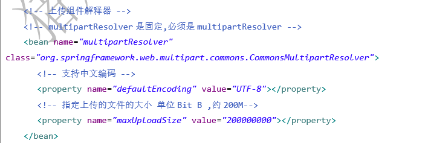
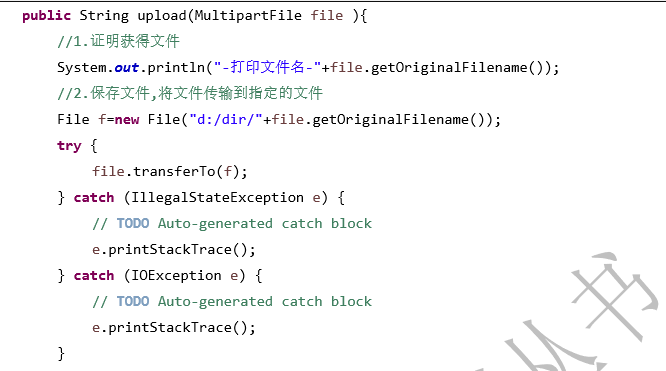
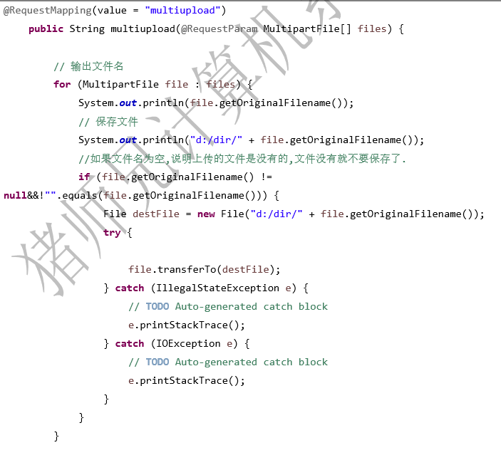
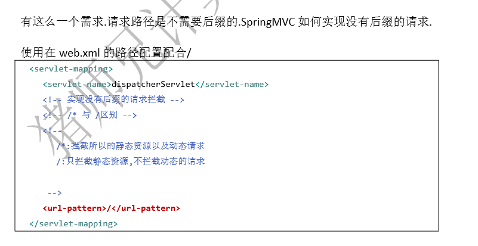
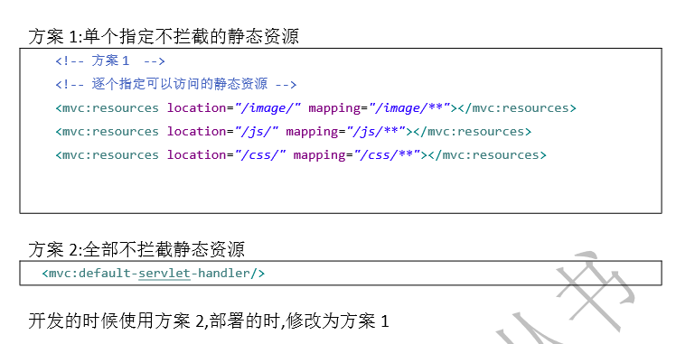

### 上传和下载的实现
**单文件上传**  
1. SpringMVC的上传组件用的是apache的commons-fileupload这个组件，而fileupload依赖commons-io组件，所以需要导入这两个jar包
2. 添加组件配置

        
3. 前端页面上传表单
4. 后台代码接收

:::
注意：因为上传组件是使用名字来获取对象的，所以名字是固定的，必须为"multipartResolver"
:::
        
**多文件上传**  

     
### 静态资源404问题
     
   
配置/后，会导致静态资源无法访问
    

    

   
   
    
    