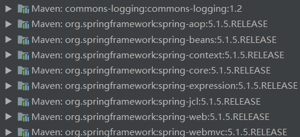
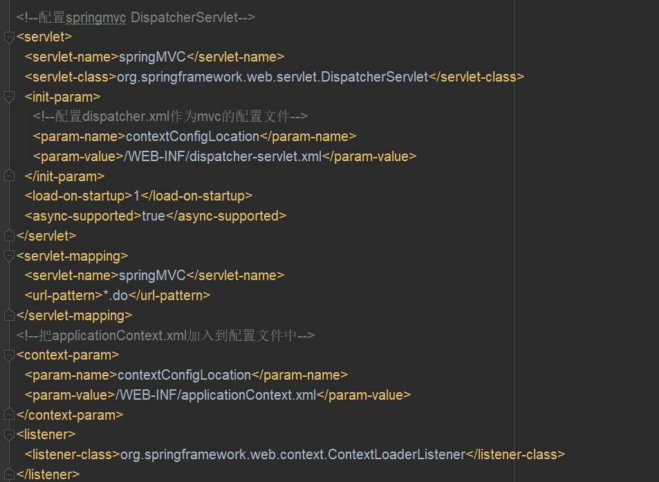
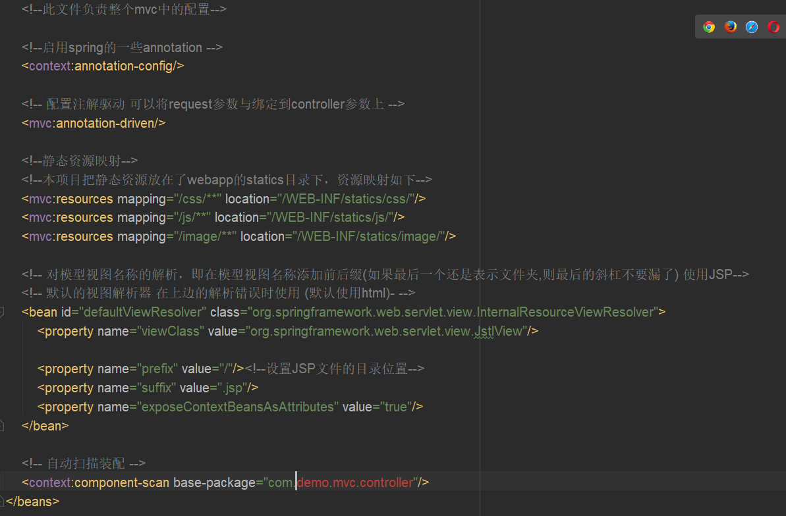
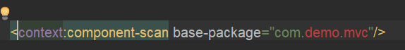
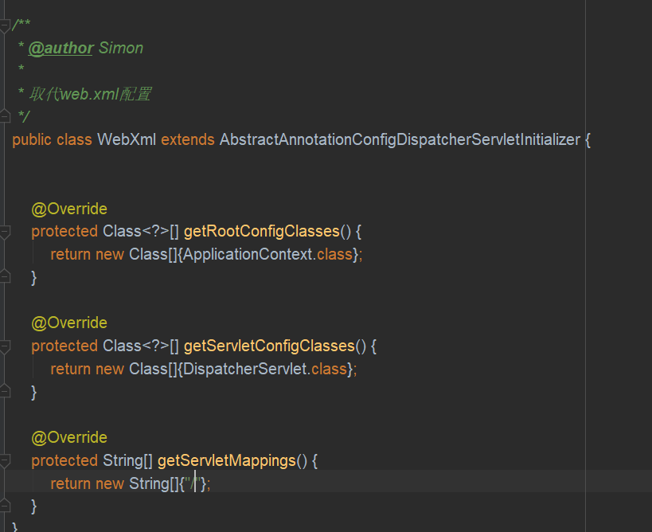
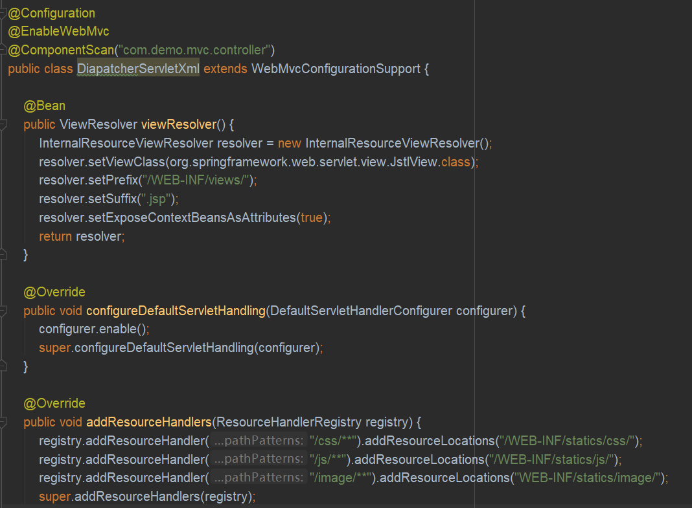
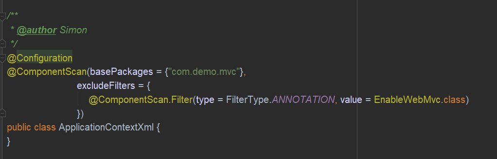

### 入门示例
**配置流程**  
1. 创建一个请求及返回页面
2. 配置web.xml的核心控制器
3. 创建Spring配置文件
4. 创建业务控制器
        
**必需基础jar包**  

   
### 示例创建步骤
1. 使用idea快速创建webapp项目，导入所需jar包
2. 编写视图
3. 配置web.xml，添加对Dispatcher和config的扫描

   
4. 在dispatcher中添加对mvc的配置

        
5. 在applicationContext.xml中添加对spring的配置

   
6. 添加java代码，配置tomcat进行测试
        
### 使用java配置取代xml配置
1. 取代web.xml

   
2. 取代dispatcher-servlet.xml

   
3. 取代applicationContext.xml

   
[参考博文](https://blog.csdn.net/wenxingchen/article/details/78563317)
   
