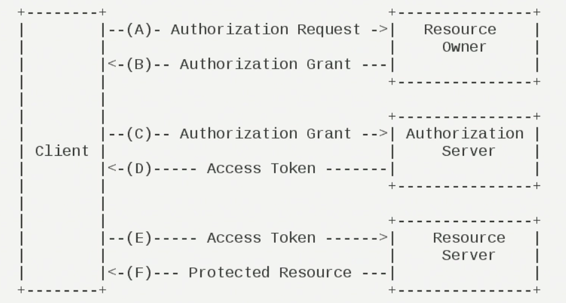

### 什么是Spring Cloud OAuth2
OAuth2是一个标准的授权协议，OAuth2对OAuth1没有做兼容，完全废弃了OAuth1。OAuth2允许不同的客户端通过认证和授权的形式来访问被其保护起来的资源。在认证和授权的过程中，主要包含以下3种角色：
* 服务提供方 Authorization Server
* 资源持有方 Resource Server
* 客户端 Client

### OAuth2认证流程

OAuth2的认证流程如下：
1. 客户端向资源持有者请求授权，授权请求可以直接对资源持有者进行，或者通过授权服务器作为中介进行间接访问
2. 资源所有者允许授权，并返回凭证
3. 客户端通过授权服务器进行身份验证，并提供授权凭证，请求访问令牌
4. 授权服务器对客户端进行身份验证，并验证授权凭证，如果有效，则发出访问令牌
5. 客户端向资源服务器请求受保护的资源，并通过提供访问令牌来进行身份验证
6. 资源服务器验证访问令牌，如果正确则返回受保护资源

### 如何使用Spring OAuth2
OAuth2协议在Spring Resource中的实现为Spring OAuth2，Spring OAuth2分为两个部分，分别是OAuth2 Provider和OAuth2 Client
  
### OAuth2 Provider
OAuth2 Provider负责公开被OAuth2保护起来的资源，OAuth2 Provider需要配置代表用户的OAuth2客户端信息，被用户允许的客户端就可以访问被OAuth2保护起来的资源。OAuth2 Provider通过管理和验证OAuth2令牌来控制客户端是否有权限访问被其保护起来的资源。另外，OAuth2 Provider还必须为用户提供认证API接口。根据认证API接口，用户提供账号密码等信息，来确认客户端是否可以被OAuth2 Provider授权。这样做的好处就是第三方客户端不需要获取用户的账号密码，通过授权的方式就可以访问被OAuth2保护起来的资源

OAuth2 Provider的角色被分为Authorization Service（授权服务）和Resource Service（资源服务），通常他们不在一个服务中，可能一个Authorization Service对应多个Resource Service。Spring OAuth2需配合Spring Security一起使用，所有的请求由SpringMVC控制器处理，并经过一系列的Spring Security过滤器在Spring Security过滤器中有以下两个节点，这两个节点是向Authorization Service获取验证和授权的：
* 授权节点：默认为/oauth/authorize
* 获取Token节点：默认为/oauth/token

**Authorization Server配置**  
在配置Authorization Server时，需要考虑客户端从用户获取访问令牌的授权类型，Authorization Server配置客户端的详细信息和令牌服务的实现。在任何实现了AuthorizationServerConfigure接口的类上加@EnableConfigurationServer注解，开启Authorization Server功能，以bean的形式注入Spring IOC的容器中，并需要实现以下3个配置：
* ClientDetailsServiceConfigure：配置客户端信息
* AuthorizationServerEndpointsConfigure：配置授权Token的节点和Token服务
* AuthorizationServerSecurityConfigure：配置Token节点的安全策略

**ClientDetailsServiceConfigure**  
客户端的配置信息既可以放在内存里，也可以放在数据库中，需要配置以下信息：
* clientId：客户端id，需要在Authorization Server中是唯一的
* secret：客户端的密码
* scope：客户端的域
* authorizedGrantTypes：认证类型
* authorities：权限信息
客户端信息可以存储在数据库中，这样就可以通过更改数据库来实时更新客户端信息的数据，Spring OAuth2已经设计好了数据库的表，且不可表 

**AuthorizationServerEndpointsConfigure**  
在默认情况下，AuthorizationServerEndpointsConfigure配置开启了所有的验证类型，除了密码验证的类型，密码验证只有配置了authorizationManager的配置才会开启。AuthorizationServerEndpointsConfigure配置由以下5项组成：
* authorizationManger：只有配置了该选项，密码认证才会开启，在大多数情况下都是密码验证，所以一般都会配置这个选项
* userDetailsService：配置获取用户认证信息的接口
* authorizationCodeServices：配置验证码服务
* implicitGrantService：配置管理implicit验证的状态
* tokenGranter：配置Token Granter
        
另外，需要配置Token的管理策略，目前支持以下三种方式：
* InMemoryTokenStore：Token存储在内存中
* JdbcTokenStore：存储在数据库中，需引入spring-jdbc的依赖包，并配置数据源，以及初始化Spring OAuth2的数据库脚本
* JwtTokenStore：采用JWT形式，这种形式没有做任何的存储因为JWT本身包含了用户验证的所有信息，不需要存储，采用这种形式，需引入spring-jwt的依赖包 

**AuthorizationServerSecurityConfigure**  
如果资源服务和授权服务是在同一个服务中，用默认的配置即可，不需要做其他任何的配置。如果资源服务和授权服务不在同一个服务中，则需要做一些额外配置。如果采用RemoteTokenService（远程Token校验），资源服务器的每次请求所携带的Token都需要从授权服务做校验。这时需要配置"/oauth/check_token"校验节点的策略

**Resource Server的配置**  
Resource Server（可以是授权服务器、也可以是其它的资源服务）提供了收OAuth2保护的资源，这些资源为API接口、Html页面、Js文件等。Spring OAuth2提供了实现了此保护功能的Spring Security认证过滤器。在加了@Configuration注解的配置类上加@EnableResourceServer注解，开启了Resource Server的功能，并使用ResourceServerConfigure进行配置（如有必要），需要配置以下内容：
* tokenService：定义Token Service。例如以ResourceServerTokenService类，配置Token是如何编码和解码的，如果Resource Server和Authorization Server在同一个工程上，则不需要配置tokenServices，如果不在同一个程序上就需要配置。也可以用RemoteTokenService类，即Resource Server采用远程授权服务器进行Token解码，这时也不需要配置此选项
* resourceId：配置资源Id

### OAuth2 Client
OAuth2 Client（客户端）用于访问被OAuth2保护起来的资源，客户端需要提供用于存储用户的授权码和访问令牌的机制，需要配置如下两个选项：
* Protected Resource Configuration（受保护资源配置）
* Client Configuration（客户端配置）

**Protected Resource Configuration**  
使用OAuth2ProtectedResourceDetails类型的Bean来定义受保护的资源，受保护的资源具有以下属性：
* Id：资源的Id，他在Spring OAuth2协议中没有用到，用于客户端寻找资源，不需要做配置，默认即可
* clientId：OAuth2 Client的Id，和之前OAuth2 Provider中的配置一一对应
* accessTokenUri：获取Token的API节点
* scope：客户端的域
* clientAuthorizationScheme：有两种客户端验证类型，分别为Http Basic和Form，默认为Http Basic
* userAuthorizationUri：如果用户需要授权访问资源，则用户将被重定向到的认证Url

**Client Configuration**  
对于OAuth2 Client的配置，可以使用@EnableOAuth2Client注解来简化配置，另外还需要配置以下两项：
* 创建一个过滤器Bean（Bean的Id为oauth2ClientContextFilter），用来存储当前请求和上下文的请求，在请
* 求期间，如果用户需要进行身份验证，则用户会被重定向到OAuth2的认证Url
* 在Request域内创建AccessTokenRequest类型的Bean
 
