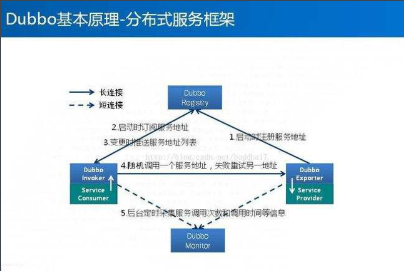
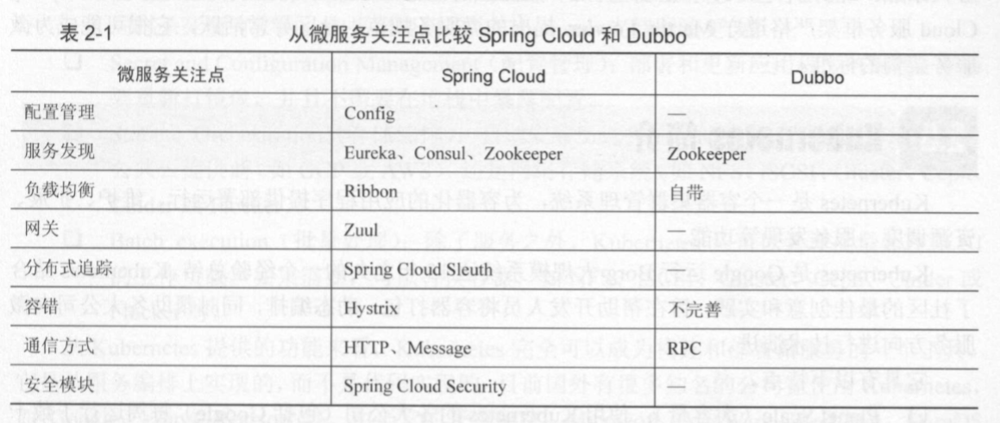

### 微服务应该具备的功能
* 服务的注册与发现
  * 服务注册是指向服务注册中心注册一个服务实例，服务提供者将自己的服务信息告知服务注册中心。服务发现是指当服务消费者需要消费另外一个服务时，服务注册中心能够告知服务消费者它所要消费服务的实例信息。通常情况下，一个服务既是服务提供者，也是服务消费者，服务消费者一般采用HTTP协议或者消息组件这种轻量级的通信机制来进行服务消费。通常一个服务实例注册后，会定时向服务注册中心提供"心跳"，以表明自己还处于可用的状态，因此注册中心还需提供健康检查方案，剔除"死亡"服务和注册"新生"服务
* 服务的负载均衡
  * 服务的负载均衡一般最流行的做法是所有的服务都向服务注册中心注册，服务注册中心持有每个服务的应用名和IP地址等信息，同时每个服务也会获取所有服务注册列表信息。服务消费者集成负载均衡组件，该组件会向服务消费者获取服务注册列表信息，并每隔一段时间重新刷新获取该列表。当服务消费者消费服务时，负载均衡组件获取服务提供者所有实例的注册信息，并通过一定的负载均衡策略（开发者可以配置〉，选择一个服务提供者的实例，向该实例进行服务消费，这样就实现了负载均衡
* 服务的容错
  * 当一个服务的处理用户请求的失败次数在一定时间内小于设定的阀值时，熔断器处于关闭状态，服务正常： 当服务处理用户请求的失败次数大于设定的阀值时，说明服务出现了故障，打开熔断器，这时所有的请求会执行快速失败，不执行业务逻辑。当处于打开状态的熔断器时，一段时间后会处于半打开状态，并执行一定数量的请求，剩余的请求会执行快速失败，若执行的请求失败了，则继续打开熔断器；若成功了，则将熔断器关闭 
* 服务网关
  * 在微服务系统中，API接口资源通常是由服务网关（也称API网关）统一暴露，内部服务不直接对外提供API资源的暴露。这样做的好处是将内部服务隐藏起来，外界还以为是一个服务在提供服务，在一定程 度上保护了微服务系统的安全。API网关通常有请求转发的作用，另外它可能需要负责一定的安全验证，例如判断某个请求是否合法，该请求对某一个资源是否具有操作权限等 
* 服务配置的统一管理
  * 管理系统配置文件
* 服务链路追踪
 
### Spring Cloud
**简介**  
Spring Cloud是基于Spring Boot的，Spring Boot的主要特点是简化了开发和部署的过程，简化了Spring复杂的配置和依赖管理，通过起步依赖和内部Servlet容器能够使开发者迅速搭起一个Web工程。Spring Cloud的首要目标就是通过一系列开发组件和框架，帮助开发者迅速搭建一个分布式的微服务系统 

**项目一览表**  
* Spring Cloud Config：服务配置中心
* Spring Cloud Netflix：Spring Cloud核心组件，包含众多组件
  * Eureka：服务注册和发现组件 
  * Hystrix：熔断器组件
  * Zuul：智能路由网关组件
  * Feign：声明式远程调度组件
  * Ribbon：负载均衡组件
  * Archaius：配置管理API的组件
* Spring Cloud Bus：消息总线服务
* Spring Cloud Sleuth：服务链路追踪组件
* Spring Cloud Data Flow：大数据操作组件
* Spring Cloud Security：安全模块组件
* Spring Cloud Consul：对Consul的封装，服务注册和发现组件
* Spring Cloud Zookeeper：对Zookeeper的封装，服务注册与发现
* Spring Cloud Stream：数据流操作组件
* Spring Cloud CLI：对Spring Boot CLI的封装，可以命令行方式快速运行和搭建容器
* Spring Cloud Task：基于Spring Task，提供了任务调度和任务管理的功能
* Spring Cloud Connectors：用于Paas云平台连接到后端

### Dubbo简介
Dubbo是阿里巴巴开源的一个分布式服务框架，致力于提供高性能和透明化的RPC远程服务调用方案，以及SOA服务治理方案  
它包含如下核心内容：
* RPC远程调用：封装了长连接的NIO框架，采用的是多线程的模式
* 集群容错：提供了基于接口方法的远程调用的功能，并实现了负载均衡策略、失败容错等功能
* 服务发现：集成了Apache的Zookeeper，用于服务注册和发现
  
**Dubbo架构流程图**  

Dubbo具备以下特性：
* 连通性：注册中心负责服务的注册，监控中心负责收集调用次数、调用时间，注册中心、服务提供者、服务消费者为长连接
* 健壮性：监控中心宕机不影响其它服务的使用，注册中心和服务实例实现集群
* 伸缩性：可动态增减注册中心和服务的实例数量
* 升级性：服务集群升级，不会对现有架构造成压力

**Spring Cloud与Dubbo比较**  

