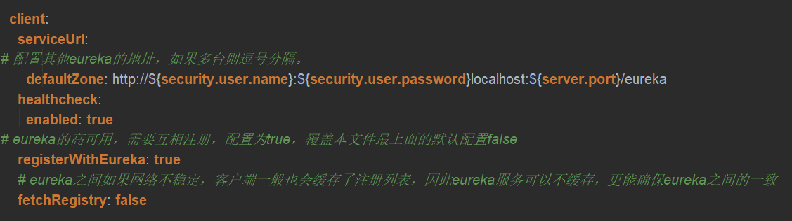

### Eureka简介
Eureka是一个服务注册与发现的组件，分为Eureka Server和Eureka Client，Eureka Server为Eureka服务注册中心，Eureka Client为Eureka客户端

Eureka基本架构，主要分为以下3个角色：
* Register Service：服务注册中心，提供服务注册与发现功能
* Provider Service：服务提供者，提供服务
* Consumer Service：服务消费者，消费服务

### 源码解析
Eureka的一些概念
* Register--服务注册
  * 当Eureka Client向Eureka Server注册时 ，Eureka Client提供自身的元数据，比如IP地址、端口、运行状况指标的URL，主页地址等信息
* Renew--服务续约
  * Eureka Client在默认情况下会每隔30S发送一次心跳来进行服务续约，通过服务续约来告知Eureka Server该Eureka Client仍然可用，正常情况下，如果Eureka Server在90S内仍未收到Eureka Client的心跳，Eureka Server会将该Eureka Client实例从服务注册表中删除，官网建议不要修改服务续约的间隔时间 
* Fetch Registries--获取服务注册列表信息
  * Eureka Client从Eureka Server获取服务注册表信息，并将其缓存在本地。Eureka Client会使用服务注册列表信息查找其它服务的信息，从而进行远程调用。该注册列表信息每30S更新一次，每次返回注册列表信息可能与Eureka Client缓存的信息不同，Eureka Client会自己处理这些信息。如果某种原因导致注册信息表未能即时匹配，并将整个注册表以及每个应用程序的信息进行了压缩，压缩内容与未压缩的内容完全相同。Eureka Server和Eureka Client可以使用JSON和XML数据格式进行通信。在默认情况下，Eureka Client使用JSON格式的方式来获取服务注册列表的信息 
* Cancel--服务下线
  * Eureka Client在程序关闭时可以向Eureka Server发送下线请求，发送请求后，该客户端的实例信息会从EurekaServer的服务注册列表中删除，该下线请求不会自动完成，需要在程序关闭时调用以下代码：DiscoverManager.getInstance().shutdownComponent();
* Eviction--服务剔除
  * 在默认情况下，当Eureka Client连续90秒没有向Eureka Server发送服务续约（即心跳）时，Eureka Server会将该服务实例从服务注册列表删除，即服务剔除 

**Eureka的高可用架构**  
服务注册列表信息和服务续约信息会被复制到集群中的每个Eureka Server节点，来自任何区域的Eureka Client都可以获取整个系统的服务注册列表信息。根据这些注册列表信息，Application Client可以远程调用Application Serveice来消费服务

**为什么Eureka Client获取服务实例这么慢**  
1. Eureka Client的延迟注册
   * Eureka Client启动之后，不是立即向Eureka Server注册的，而是有一个延迟向服务端注册的时间，默认的延迟时间为40S
2. Eureka Server的响应缓存
   * Eureka Client维护每30S更新一次响应缓存
3. Eureka Client的缓存
   * Eureka Client保留注册信息表的缓存，每30S更新一次
4. LoadBalancer的缓存
   * Ribbon的负载均衡器从本地的Eureka Client获取服务注册列表信息，Ribbon本身还维护了缓存，每30S更新一次

### Eureka配置文件常用属性
**Eureka Server配置文件**  
  

**Eureka Client配置文件**  

