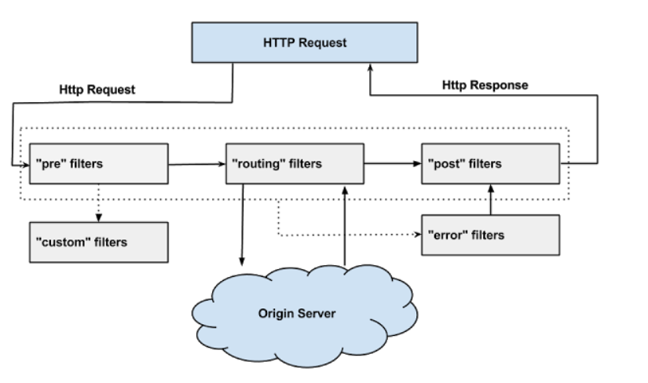

### 为什么需要Zuul
Zuul作为路由网关组件，在微服务架构中有着非常重要的作用，主要体现在以下6个方面：
* Zuul、Ribbon以及Eureka相结合，可以实现智能路由和负载均衡的功能，Zuul能够将请求流量按某种策略分发到集群状态的多个服务实例
* 网关将所有服务的API接口统一聚合，并统一对外暴露。外界系统调用API接口时，都是由网关对外暴露的API接口，外界系统不需要知道微服务系统中各服务相互调用的复杂性。微服务系统也保护了其内部微服务单元的API接口，防止其被外界直接调用，导致服务的敏感信息对外暴露
* 网关服务可以做到用户认证和权限认证，防止非法请求操作API接口，对服务器起到保护作用
* 网关可以实现监控功能，实时日志输出，对请求进行记录
* 网关可以用来实现流量监控，在高流量的情况下，对服务进行降级
* API接口从内部服务分离出来，方便做测试

### Zuul的工作原理
Zuul是通过Servlet来实现的，Zuul通过自定义的ZuulServlet来对请求进行控制。Zuul的核心是一系列过滤器，可以在Http请求的发起和响应返回期间执行一系列的过滤器。Zuul包括以下4种过滤器：
* PRE过滤器：它是在请求路由到具体服务之前执行的，这种类型的过滤器可以做安全验证
* ROUTING过滤器：它用于将请求路由到具体的微服务实例，默认情况下，它使用Http Client进行网络请求
* POST过滤器：它是在请求已被路由到微服务后执行的，一般情况下，用作收集统计信息、指标以及将响应传输给客户端
* ERROR过滤器：它是在其它过滤器发生错误时执行的
    
Zuul采取了动态读取、编译和运行这些过滤器。过滤器之间不能直接相互通信，而是通过RequestContext对象来共享数据，每个请求都会创建一个RequestContext对象。Zuul过滤器具有以下关键特性：
* Type（类型）：Zuul过滤器的数据，这个类型决定了过滤器在那个阶段起作用
* Execution Order（执行顺序）：规定了过滤器的执行顺序，Order的值越小，越先执行
* Criteria（标准）：Filter执行所需的条件
* Action（行动）：如果符合执行条件，则执行Action（即逻辑代码） 

### 代码示例
[zuul网关](https://gitee.com/CK_Simon/cloud-demo/tree/master/eureka-zuul-client)

### Zuul的常见使用方式
Zuul是采用了类似于SpringMVC的DispatcherServlet来实现的，采用的是异步阻塞模型，所以性能比Nginx差。由于Zuul和其它Netflix组件可以相互配合、无缝集成，Zuul很容易就能实现负载均衡、智能路由和熔断器等功能。在大多数情况下，Zuul都是以集群形式存在的。由于Zuul的横向扩展能力非常好，所以当负载过高时，可以通过添加实例来解决性能瓶颈

一种常见的使用方式是对不同的渠道使用不同的Zuul来进行路由。另一种常见的集群是通过Nginx和Zuul相互结合来做负载均衡。暴露在最外层的是Nginx主从双热备进行Keepalive，Nginx通过某种路由策略，将请求路由转发到Zuul集群上，Zuul最终将请求分发到具体的服务上

