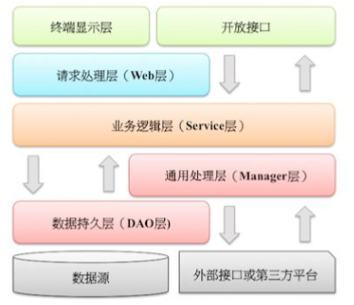

## 应用分层
1. [推荐] 图中默认上层依赖于下层，箭头关系表示可直接依赖，如：

   
2. [参考] 分层领域模型规约： 
   * DO（Data Object）：此对象与数据库表结构一一对应，通过 DAO 层向上传输数据源对象
   * DTO（Data Transfer Object）：数据传输对象，Service 或 Manager 向外传输的对象
   * BO（Business Object）：业务对象，由 Service 层输出的封装业务逻辑的对象
   * AO（Application Object）：应用对象，在 Web 层与 Service 层之间抽象的复用对象模型， 极为贴近展示层，复用度不高
   * VO（View Object）：显示层对象，通常是 Web 向模板渲染引擎层传输的对象
   * Query：数据查询对象，各层接收上层的查询请求。注意超过 2 个参数的查询封装，禁止 使用 Map 类来传输
                  
## 二方库依赖
1. [强制] 定义 GAV 遵从以下规则： 
   * GroupID 格式：com.{公司/BU }.业务线 （.子业务线），最多 4 级
   * ArtifactID 格式：产品线名-模块名。语义不重复不遗漏，先到中央仓库去查证一下
2. [强制] 二方库版本号命名方式：主版本号.次版本号.修订号
3. [强制] 线上应用不要依赖 SNAPSHOT 版本（安全包除外）
4. [强制] 二方库的新增或升级，保持除功能点之外的其它 jar 包仲裁结果不变
5. [强制] 二方库里可以定义枚举类型，参数可以使用枚举类型，但是接口返回值不允许使用枚 举类型或者包含枚举类型的 POJO 对象
6. [强制] 依赖于一个二方库群时，必须定义一个统一的版本变量，避免版本号不一致
7. [强制] 禁止在子项目的 pom 依赖中出现相同的 GroupId，相同的 ArtifactId，但是不同的 Version
8. [推荐] 所有 pom 文件中的依赖声明放在dependencies语句块中，所有版本仲裁放在 dependencyManagement语句块中
9. [推荐] 二方库不要有配置项，最低限度不要再增加配置项
       
## 服务器
1. [推荐] 高并发服务器建议调小 TCP 协议的 time_wait 超时时间
2. [推荐] 调大服务器所支持的最大文件句柄数（File Descriptor，简写为 fd）
3. [推荐] 给 JVM 环境参数设置-XX:+HeapDumpOnOutOfMemoryError 参数，让 JVM 碰到 OOM 场 景时输出 dump 信息
4. [推荐] 在线上生产环境，JVM 的 Xms 和 Xmx 设置一样大小的内存容量，避免在 GC 后调整堆 大小带来的压力
5. [参考] 服务器内部重定向使用 forward；外部重定向地址使用 URL 拼装工具类来生成，否则 会带来 URL 维护不一致的问题和潜在的安全风险
