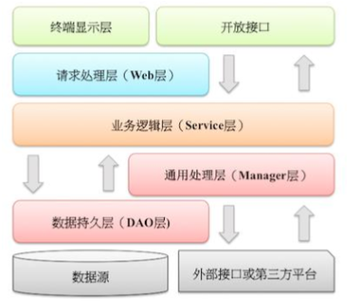

## 异常日志
  ### 异常处理
        1. [强制] Java类库中可以通过预检查方法规避的RuntimeException异常不应该通过catch方式来处理，如空指针
                  异常等
        2. [强制] 异常不要用来做流程控制，条件控制
        3. [强制] catch时请分清稳定代码和非稳定代码，稳定代码指的是无论如何都不会出错的代码，对于非稳定代码的
                  catch尽可能进行区分异常类型，再做对应的异常处理
        4. [强制] 捕获异常是为了处理它，不要捕获了却不做任何处理，如果不想处理它，请将异常抛给他的调用者，最外
                  层的业务使用者，必须处理异常，将其转换成用户可以理解的内容
        5. [强制] 有try块放到了事务代码中，catch异常后，如果需要回滚事务，一定要注意手动回滚事务
        6. [强制] finally块必须对资源对象、流对象进行关闭，有异常也要做try-catch
        7. [强制] 不要在finally块中使用return
        8. [强制] 捕获异常与抛异常，必须完全匹配，或者捕获异常是抛异常的父类
        9. [推荐] 方法的返回值可以为null，不强制返回空集合，或者空对象等，必须添加注释充分说明什么情况下会返回
                   null值
        10.[推荐]防止 NPE，是程序员的基本修养，注意 NPE 产生的场景：  
                 1）返回类型为基本数据类型，return 包装数据类型的对象时，自动拆箱有可能产生 NPE。     
                 2） 数据库的查询结果可能为 null  
                 3） 集合里的元素即使 isNotEmpty，取出的数据元素也可能为 null  
                 4） 远程调用返回对象时，一律要求进行空指针判断，防止 NPE  
                 5） 对于 Session 中获取的数据，建议 NPE 检查，避免空指针  
                 6） 级联调用 obj.getA().getB().getC()；一连串调用，易产生 NPE
        11.[推荐] 定义时区分 unchecked / checked 异常，避免直接抛出 new RuntimeException()， 更不允许
                  抛出 Exception 或者Throwable，应使用有业务含义的自定义异常。推荐业界已定义 过的自定义
                  异常 
        12.[参考] 对于公司外的 http/api 开放接口必须使用“错误码”；而应用内部推荐异常抛出； 跨应用间 RPC 调
                  用优先考虑使用 Result 方式，封装 isSuccess()方法、“错误码”、“错误简 短信息” 
                  
  ### 日志规约
        1. [强制] 应用中不可直接使用日志系统(Log4j、Logback)中的API，而应依赖使用日志框架SLF4J中的API，使用
                  门面模式的日志日志框架，有利于维护和各个类的日志处理方式统一
        2. [强制] 日志文件至少保存15天，因为有些异常具备以"周"为频率发生的特点
        3. [强制] 应用中的扩展日志（如打点、临时监控、访问日志等）命名方式： appName_logType_logName.log
                  logType:日志类型，如 stats/monitor/access 等；logName:日志描述
        4. [强制] 对trace/debug/info级别的日志输出，必须使用条件输出形式或者使用占位符的方式
        5. [强制] 避免重复打印日志，浪费磁盘空间，务必在log4j.xml中设置additivity = false
        6. [强制] 异常信息应该包括两类信息：案发现场信息和异常堆栈信息，如果不处理，那么通过关键字throws往上抛
        7. [推荐] 谨慎地记录日志。生产环境禁止输出 debug 日志；有选择地输出 info 日志；如果使 用 warn 来记录
                  刚上线时的业务行为信息，一定要注意日志输出量的问题，避免把服务器磁盘 撑爆，并记得及时删除这
                  些观察日志 
        8. [推荐] 可以使用warn日志级别用来记录用户参数参数错误的情况，避免用户投诉时，无所适从
        9. [推荐] 尽量用英文来描述日志错误信息，如果日志中的错误信息用英文描述不清楚的话使用中文即可，避免歧义
        
## 单元测试
        1. [强制] 好的单元测试必须遵守AIR原则
                  * A：Automatic（自动化） 
                  * I ：Independent（独立性）
                  * R：Repeatable（可重复）  
        2. [强制] 单元测试应该是全自动执行的，并且非交互式的
        3. [强制] 保持单元测试的独立性
        4. [强制] 单元测试是可以重复执行的，不能收到外界环境的影响
        5. [强制] 对于单元测试，要保证测试粒度足够小，有助于精确定位，单测粒度至多是类级别，一般是方法级别
        6. [强制] 核心业务、核心应用、核心模块的增量代码确保单元测试通过
        7. [强制] 单元测试代码必须卸载src/java/test下，不允许写在业务代码目录下
        8. [推荐] 单元测试的基本目标：语句覆盖率达到 70%；核心模块的语句覆盖率和分支覆盖率都 要达到 100% 
        9. [推荐] 编写单元测试代码遵守 BCDE 原则，以保证被测试模块的交付质量
                  * B：Border，边界值测试，包括循环边界、特殊取值、特殊时间点、数据顺序等
                  * C：Correct，正确的输入，并得到预期的结果
                  * D：Design，与设计文档相结合，来编写单元测试
                  * E：Error，强制错误信息输入（如：非法数据、异常流程、非业务允许输入等），并得 到预期的结果
        10.[推荐] 对于数据库相关的查询，更新，删除等操作，不能假设数据库里的数据是存在的， 或者直接操作数据库把数
                  据插入进去，请使用程序插入或者导入数据的方式来准备数据
        11.[推荐] 和数据库相关的单元测试，可以设定自动回滚机制，不给数据库造成脏数据。或者 对单元测试产生的数据有
                  明确的前后缀标识
        12.[推荐] 对于不可测的代码建议做必要的重构，使代码变得可测，避免为了达到测试要求而 书写不规范测试代码
        13.[推荐] 在设计评审阶段，开发人员需要和测试人员一起确定单元测试范围，单元测试最好 覆盖所有测试用例
        14.[推荐] 单元测试作为一种质量保障手段，不建议项目发布后补充单元测试用例，建议在项 目提测前完成单元测试
        15.[参考] 为了更方便地进行单元测试，业务代码应避免以下情况： 
                  * 构造方法中做的事情过多
                  * 存在过多的全局变量和静态方法
                  * 存在过多的外部依赖
                  * 存在过多的条件语句
        16.[参考] 不要对单元测试存在如下误解： 
                  * 那是测试同学干的事情。本文是开发手册，凡是本文内容都是与开发同学强相关的
                  * 单元测试代码是多余的。系统的整体功能与各单元部件的测试正常与否是强相关的
                  * 单元测试代码不需要维护。一年半载后，那么单元测试几乎处于废弃状态
                  * 单元测试与线上故障没有辩证关系。好的单元测试能够最大限度地规避线上故障
   
## 安全规约
        1. [强制] 隶属于用户个人的页面或者功能必须进行权限控制校验
        2. [强制] 用户敏感数据禁止直接展示，必须对展示数据进行脱敏
        3. [强制] 用户输入的 SQL 参数严格使用参数绑定或者 METADATA 字段值限定，防止 SQL 注入， 禁止字符串拼
                  接 SQL访问数据库
        4. [强制] 用户请求传入的任何参数必须做有效性验证
        5. [强制] 禁止向 HTML 页面输出未经安全过滤或未正确转义的用户数据
        6. [强制] 表单、AJAX 提交必须执行 CSRF 安全验证
        7. [强制] 在使用平台资源，譬如短信、邮件、电话、下单、支付，必须实现正确的防重放的机制
        8. [推荐] 发贴、评论、发送即时消息等用户生成内容的场景必须实现防刷、文本内容违禁词过 滤等风控策略
        
## MySQL数据库
   ### 建表规约
        1. [强制] 表达是与否概念的字段，必须使用is_xxx的方式命名，数据类型是 unsigned tinyint 
        2. [强制] 表名、字段名必须是小写字母或者数字，禁止出现数字开头，禁止两个下划线之间只出现数字
        3. [强制] 表名不使用复数名词
        4. [强制] 禁用保留字，如 desc、range、match、delayed 等
        5. [强制] 主键索引为pk_字段名，唯一索引为uk_字段名，普通索引为idx_字段名
        6. [强制] 小数类型为decimal，禁用float和double
        7. [强制] 如果存储的字符串长度几乎相等，使用char定长字符串类型
        8. [强制] varchar 是可变长字符串，不预先分配存储空间，长度不要超过 5000，如果存储长 度大于此值，定义字
                  段类型为 text，独立出来一张表，用主键来对应，避免影响其它字段索 引效率 
        9. [强制] 表必备三字段：id, gmt_create, gmt_modified
        10.[推荐] 表的名称最好是"业务名称_表的左右"
        11.[推荐] 库名与应用名称尽量一致
        12.[推荐] 如果修改字段含义或对字段表示的状态追加时，需要即使更新字段注释
        13.[推荐] 字段允许适当冗余，以提高查询性能，但必须考虑数据一致。冗余字段应遵循： 
                  1) 不是频繁修改的字段
                  2) 不是varchar类型的字段，更不能是text类型的字段
        14.[推荐] 单表行数超过 500 万行或者单表容量超过 2GB，才推荐进行分库分表
        15.[参考] 合适的字符存储长度，不但节约数据库表空间、节约索引存储，更重要的是提示检索速度 
        
   ### 索引规约
        1. [强制] 业务上具有唯一特性的字段，即使是多个字段的组合，也必须建成唯一索引
        2. [强制] 超过三个表禁止join
        3. [强制] 在varchar字段上建立索引时，必须指定索引长度，没必要对全字段建立索引，根据实际文本区分度建立即
                  可
        4. [强制] 页面搜索严禁左模糊或者全模糊，如果需要请走搜索引擎来解决
        5. [强制] 如果有order by的场景，请注意利用索引的有序性
        6. [推荐] 利用覆盖索引来进行查询操作，避免回表
        7. [推荐] 利用延迟关联或者子查询优化超多分页场景
        8. [推荐] SQL 性能优化的目标：至少要达到 range 级别，要求是 ref 级别，如果可以是 consts 最好
                  1) consts 单表中最多只有一个匹配行（主键或者唯一索引），在优化阶段即可读取到数据
                  2) ref 指的是使用普通的索引（normal index）
                  3) range 对索引进行范围检索。
        9. [推荐] 建组合索引时，区分度最高的在最左边
        10.[推荐] 防止因字段类型不同造成的隐式转换，导致索引失效
        11.[参考] 创建索引时避免有如下极端索引
                  1) 宁滥勿缺。认为一个查询就需要建一个索引
                  2) 宁缺勿滥。认为索引会消耗空间、严重拖慢更新和新增速度
                  3) 抵制惟一索引。认为业务的惟一性一律需要在应用层通过“先查后插”方式解决
                  
   ### SQL语句
        1. [强制] 不要使用 count(列名)或 count(常量)来替代 count(*)
        2. [强制] count(distinct col) 计算该列除 NULL 之外的不重复行数
        3. [强制] 当某一列的值全是 NULL 时，count(col)的返回结果为 0，但 sum(col)的返回结果为 NULL，因此使
                  用 sum()时需注意 NPE 问题
        4. [强制] 使用 ISNULL()来判断是否为 NULL 值
        5. [强制] 在代码中写分页查询逻辑时，若 count 为 0 应直接返回，避免执行后面的分页语句
        6. [强制] 不得使用外键与级联，一切外键概念必须在应用层解决
        7. [强制] 禁止使用存储过程，存储过程难以调试和扩展，更没有移植性
        8. [强制] 数据订正（特别是删除、修改记录操作）时，要先 select，避免出现误删除，确认 无误才能执行更新语
                  句
        9. [推荐] in 操作能避免则避免，若实在避免不了，需要仔细评估 in 后边的集合元素数量，控 制在 1000 个之内
        10.[推荐] 如果有国际化需要，所有的字符存储与表示，均以 utf-8 编码，注意字符统计函数 的区别
        11.[参考] TRUNCATE TABLE 比 DELETE 速度快，且使用的系统和事务日志资源少，但 TRUNCATE 无事务且不触
                  发 trigger，有可能造成事故，故不建议在开发代码中使用此语句
                  
   ### ORM映射
        1. [强制] 在表查询中，一律不要使用 * 作为查询的字段列表，需要哪些字段必须明确写明
        2. [强制] POJO 类的布尔属性不能加 is，而数据库字段必须加 is_，要求在 resultMap 中进行 字段与属性之间
                  的映射
        3. [强制] 不要用 resultClass 当返回参数，即使所有类属性名与数据库字段一一对应，也需 要定义；反过来，每
                  一个表也必然有一个 POJO 类与之对应
        4. [强制] sql.xml 配置参数使用：#{}， #param# 不要使用${} 此种方式容易出现 SQL 注入
        5. [强制] iBATIS 自带的 queryForList(String statementName,int start,int size)不推 荐使用
        6. [强制] 不允许直接拿 HashMap 与 Hashtable 作为查询结果集的输出
        7. [强制] 更新数据表记录时，必须同时更新记录对应的 gmt_modified 字段值为当前时间
        8. [推荐] 不要写一个大而全的数据更新接口
        9. [推荐] @Transactional 事务不要滥用。事务会影响数据库的 QPS，另外使用事务的地方需 要考虑各方面的回
                   滚方案，包括缓存回滚、搜索引擎回滚、消息补偿、统计修正等
  
## 工程结构
   ### 应用分层
        1. [推荐] 图中默认上层依赖于下层，箭头关系表示可直接依赖，如：
   
   
        1. [参考] 分层领域模型规约： 
                  * DO（Data Object）：此对象与数据库表结构一一对应，通过 DAO 层向上传输数据源对象
                  * DTO（Data Transfer Object）：数据传输对象，Service 或 Manager 向外传输的对象
                  * BO（Business Object）：业务对象，由 Service 层输出的封装业务逻辑的对象
                  * AO（Application Object）：应用对象，在 Web 层与 Service 层之间抽象的复用对象模型， 极
                      为贴近展示层，复用度不高
                  * VO（View Object）：显示层对象，通常是 Web 向模板渲染引擎层传输的对象
                  * Query：数据查询对象，各层接收上层的查询请求。注意超过 2 个参数的查询封装，禁止 使用 Map 
                      类来传输
                  
   ### 二方库依赖
        1. [强制] 定义 GAV 遵从以下规则： 
                  1)  GroupID 格式：com.{公司/BU }.业务线 [.子业务线]，最多 4 级
                  2)  ArtifactID 格式：产品线名-模块名。语义不重复不遗漏，先到中央仓库去查证一下
        2. [强制] 二方库版本号命名方式：主版本号.次版本号.修订号
        3. [强制] 线上应用不要依赖 SNAPSHOT 版本（安全包除外）
        4. [强制] 二方库的新增或升级，保持除功能点之外的其它 jar 包仲裁结果不变
        5. [强制] 二方库里可以定义枚举类型，参数可以使用枚举类型，但是接口返回值不允许使用枚 举类型或者包含枚举类
                  型的 POJO 对象
        6. [强制] 依赖于一个二方库群时，必须定义一个统一的版本变量，避免版本号不一致
        7. [强制] 禁止在子项目的 pom 依赖中出现相同的 GroupId，相同的 ArtifactId，但是不同的 Version
        8. [推荐] 所有 pom 文件中的依赖声明放在<dependencies>语句块中，所有版本仲裁放在 
                  <dependencyManagement>语句块中
        9. [推荐] 二方库不要有配置项，最低限度不要再增加配置项
       
   ### 服务器
        1. [推荐] 高并发服务器建议调小 TCP 协议的 time_wait 超时时间
        2. [推荐] 调大服务器所支持的最大文件句柄数（File Descriptor，简写为 fd）
        3. [推荐] 给 JVM 环境参数设置-XX:+HeapDumpOnOutOfMemoryError 参数，让 JVM 碰到 OOM 场 景时输出 
                  dump 信息
        4. [推荐] 在线上生产环境，JVM 的 Xms 和 Xmx 设置一样大小的内存容量，避免在 GC 后调整堆 大小带来的压力
        5. [参考] 服务器内部重定向使用 forward；外部重定向地址使用 URL 拼装工具类来生成，否则 会带来 URL 维护
                  不一致的问题和潜在的安全风险
## 设计规约
        1. [强制] 存储方案和底层数据结构的设计获得评审一致通过，并沉淀成为文档
        2. [强制] 在需求分析阶段，如果与系统交互的 User 超过一类并且相关的 User Case 超过 5 个， 使用用例图来
                  表达更加清晰的结构化需求
        3. [强制] 如果某个业务对象的状态超过 3 个，使用状态图来表达并且明确状态变化的各个触发 条件
        4. [强制] 如果系统中某个功能的调用链路上的涉及对象超过 3 个，使用时序图来表达并且明确 各调用环节的输入与
                  输出
        5. [强制] 如果系统中模型类超过 5 个，并且存在复杂的依赖关系，使用类图来表达并且明确类之间的关系
        6. [强制] 如果系统中超过 2 个对象之间存在协作关系，并且需要表示复杂的处理流程，使用活动图来表示
        7. [推荐] 需求分析与系统设计在考虑主干功能的同时，需要充分评估异常流程与业务边界
        8. [推荐] 类在设计与实现时要符合单一原则
        9. [推荐] 谨慎使用继承的方式来进行扩展，优先使用聚合/组合的方式来实现
        10.[推荐] 系统设计时，根据依赖倒置原则，尽量依赖抽象类与接口，有利于扩展与维护
        11.[推荐] 系统设计时，注意对扩展开放，对修改闭合
        12.[推荐] 系统设计阶段，共性业务或公共行为抽取出来公共模块、公共配置、公共类、公共方法等，避免出现重复代
                  码或重复配置的情况
        13.[推荐] 避免如下误解：敏捷开发 = 讲故事 + 编码 + 发布
        14.[参考] 系统设计主要目的是明确需求、理顺逻辑、后期维护，次要目的用于指导编码 
        15.[参考] 设计的本质就是识别和表达系统难点，找到系统的变化点，并隔离变化点