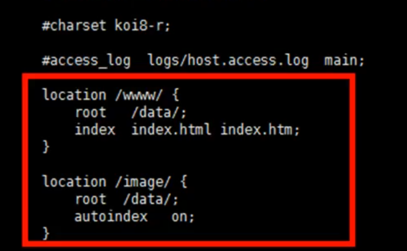

### Nginx配置实例--动静分离
Nginx动静分离简单来说就是把动态和静态请求分开，不能理解成单纯的把静态页面和动态页面分离，严格意义上说应该是把动态请求和静态请求分开，可以理解成使用nginx处理静态页面，使用tomcat处理动态页面。动静分离从目前实现角度来讲大致分为两种：一种是纯粹把静态文件独立成单独的域名，放在独立的服务器上，这也是目前主流推崇的方案，另外一种就是动态和静态文件混在一起发布，通过nginx分开
    
**实现效果**  
通过location指定不同的后缀名实现不同的请求转发，通过expires参数设置，可以使浏览器缓存过期时间，减少与服务器之间的请求和流量，这种方法比较啊适合较少变动的资源。此处设置3d，如果在3d内访问这个URL，发送一个请求，对比服务器该文件最后更新时间有没有变化，没有则不会从服务器抓取，返回状态码304，如果有修改，则直接从服务器重新下载，返回状态码200

准备工作：在linux系统中准备静态资源，用于进行访问  
动静分离实例：  
&emsp;1.在nginx.conf中进行动静分离的配置  
&emsp;2.访问资源，进行测试  

        
