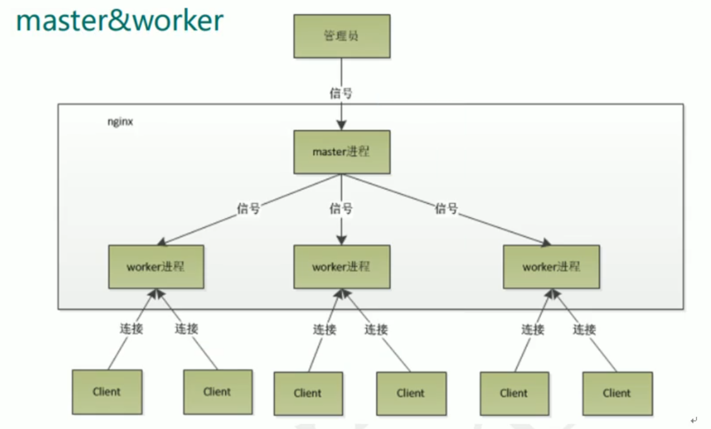

### Nginx原理

   
**master-worker机制的好处**  
首先，对于每个worker进程来说，不需要加锁，省掉了锁带来的开销，同时在编程和问题查找的时候，也会方便很多。其次，采用独立的进程，可以让互相之间不会影响，一个进程退出后，其它进程还在工作，服务不会中断，master进程则很快启动新的worker进程。当然，worker进程的异常退出，肯定是程序有bug了，异常退出，会导致当前worker上的所有请求失败，不过不会影响到所有请求，所以降低了风险
        
**需要设置多少个worker**  
Nginx同redis类似都采用了IO多路复用机制，每个worker都是一个独立的进程，但每个进程里只有一个主线程，通过异步非阻塞的方式来处理请求，即使是成千上万个请求也不在话下。每个worker的线程可以把一个CPU的性能发挥到极致，所以worker数与服务器的CPU数相等是最适宜的，设置少了会浪费CPU，设置多了会导致CPU频繁切换上下文带来的损耗