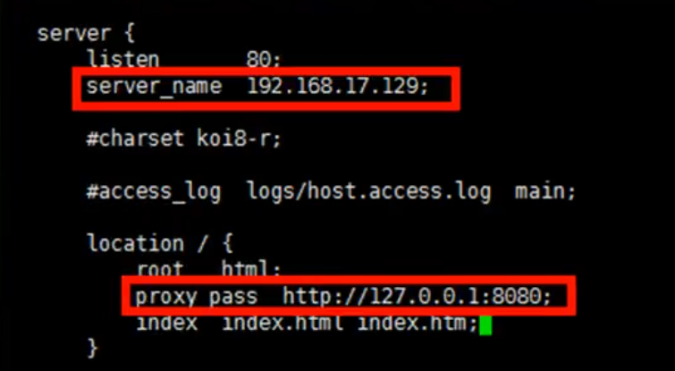
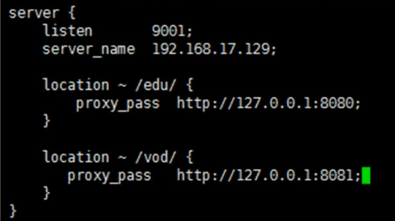

### Nginx配置实例--反向代理
**配置实例一**  
* 实现效果：打开浏览器，在地址栏输入www.123.com，跳转至linux系统tomcat主页面中
* 准备工作：
  * 安装tomcat并启动
  * 对外开放访问端口
```
firewall-cmd --add-port=8080/tcp --permanent
firewall-cmd -reload
firewall-cmd --list -all //查看开放的端口号
```
* 反向代理实例一：
  1. 在windows系统的host文件进行域名和ip对应关系的配置
  2. 在nginx进行请求转发的配置（反向代理配置）
  3. 启动nginx，访问www.123.com进行测试

    
**配置实例二**  
* 实现效果：使用nginx反向代理，根据访问的路径跳转至不同端口的服务中，nginx监听端口为9001
* 准备工作：
  * 准备两个tomcat服务器，一个8080端口，一个8081端口
  * 创建文件夹和测试页面
* 反向代理实例二：
  1. 在nginx进行请求转发的配置（反向代理配置）
  2. 开放对外端口
  3. 启动nginx，进行测试

   
