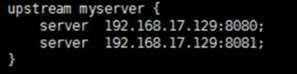
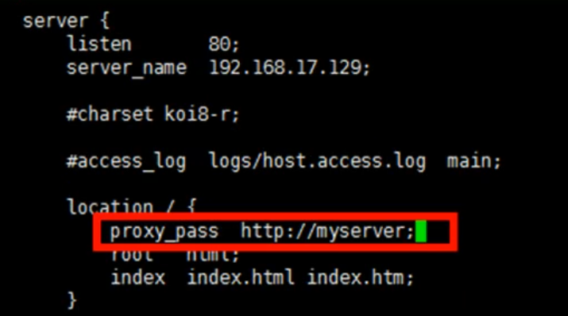

### Nginx配置实例--负载均衡
**配置实例**  
* 实现效果：浏览器地址栏输入访问地址，实现负载均衡效果，平均到8080和8081端口
* 准备工作：
  1. 准备两个tomcat服务器，一个8080端口，一个8081端口
  2. 创建文件夹和测试页面
* 负载均衡实例：
  1. 在nginx.conf中进行负载均衡的配置

   
**nginx常用分配方式**  
1. 轮询（默认）
   * 每个请求按事件顺序逐一分配到不同的后端服务器，如果后端服务器down掉，能自动剔除
2. weight
   * weight代表权重，默认为1，权重越高被分配的客户端就越多
3. ip_hash
   * 每个请求按访问ip的hash结果分配，这样每个访客固定访问一个后端服务器，可以解决session的问题
4. fair（第三方）
   * 按后端服务器的响应时间来分配请求，响应时间短的优先分配
          
