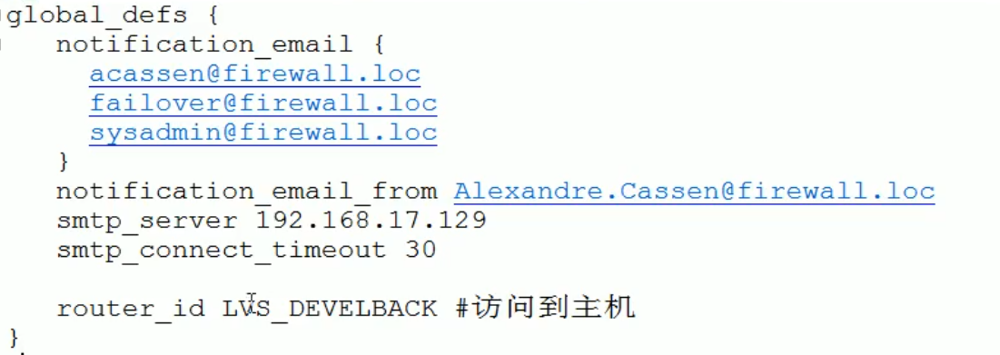
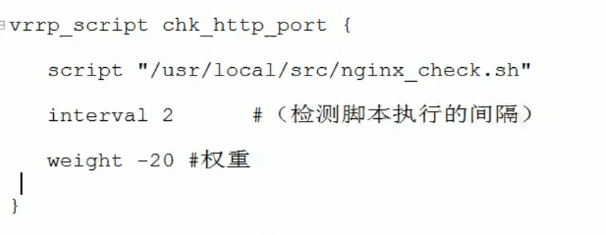
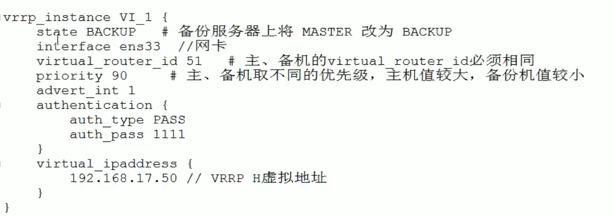

### Nginx配置实例--高可用
* 准备工作：
  * 在两台服务器上安装nginx和tomcat
  * 在两台服务器上安装keepalived
    * 使用yum命令进行安装
    * yum install keepalived -y
  * 安装之后，在etc里生成目录keepalived，有文件keepalived.conf
    
* 高可用实例：
  1. 修改/etc/keepalived/keepalived.cond配置文件
  2. 在/usr/local/src添加检测脚本
  3. 启动两台服务器上的nginx和keepalived
  4. 进行测试
        
**keepalived.conf配置文件**  

   
