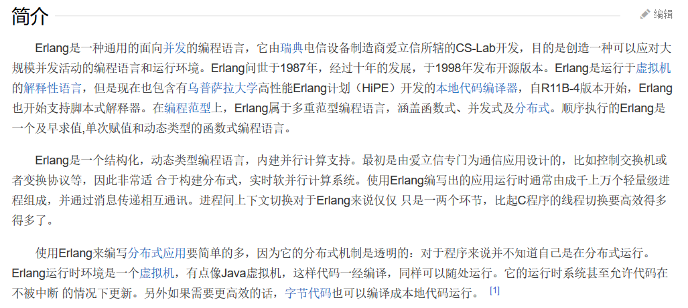
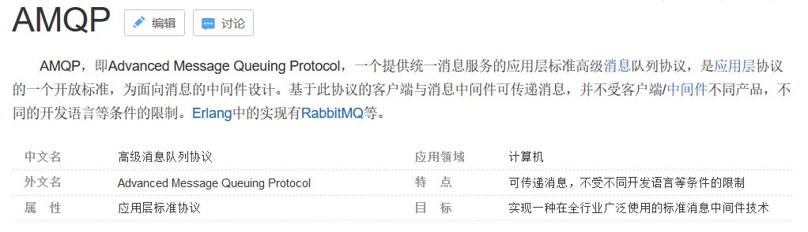

## 什么是MQ
* 消息队列（Message Queue，简称MQ），从字面意义上看，本质是个队列，FIFO先入先出，只不过队列中存放的内容是message而已  
  其主要用途：不同进程Process/线程Thread之间通信

****

为什么会产生消息队列，有几个原因：
* 不同进程（Process）之间传递消息时，两个进程之间耦合程度过高，改动一个进程，引发必须修改另一个进程，为了隔离这两个进程，在两进程之间抽离出一层（一个模块），所有两进程之间传递的消息，都必须通过消息队列来传递，单独修改某一个进程，不会影响另一个
* 不同进程（Process）之间传递消息时，为了实现标准化，将消息的格式规范化了，并且，某一个进程接收的消息太多，一下子无法处理完，并且也有先后顺序，必须对收到的消息进程排队，因此诞生了事实上的消息队列

****

什么时候不使用MQ
* 上游实时关注执行结果

什么时候使用MQ
* 数据驱动的任务依赖
* 上游不关心下游执行结果
* 异步返回执行时间长

****

MQ框架非常之多，比较流行的有RabbitMQ、ActiveMQ、ZeroMQ、Kafka以寄阿里开源的RocketMQ

## RabbitMQ
### RabbitMQ简介
* MQ为Message Queue，消息队列是应用程序与应用程序之间的通信方法
* RabbitMQ是一个开源的，在AMQP基础上完成的，可复用的企业消息系统
* 支持主流的操作系统，Linux、Windows、MacOX等
* 多种开发语言支持，Java、Python、Ruby、.NET、PHP、C/C++、node.js等

****

开发语言：Erlang-面向并发的编程语言

****

AMQP：AMQP是消息队列的一个协议
