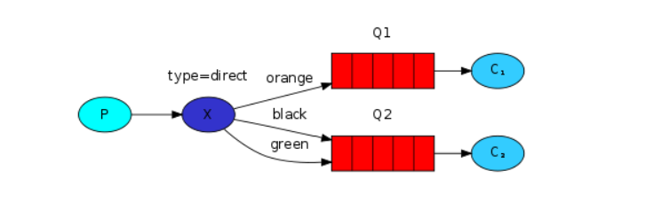
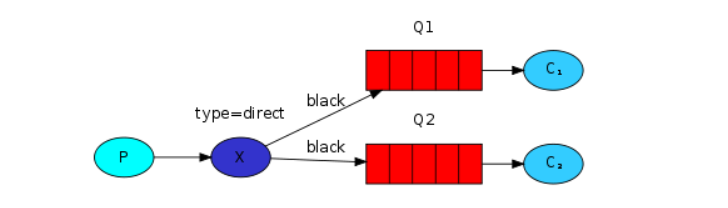
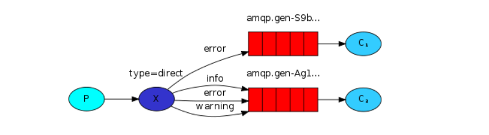

## 绑定
在fanout类型交换机中，我们使用如下代码进行绑定：
```java
channel.queueBind(queueName, EXCHANGE_NAME, "");
```
绑定的是交换机和队列之间的关系。可以简单地理解为：队列对来自此交换机的消息感兴趣

&emsp;  
绑定可以使用额外的routingKey参数。为了避免与basic_publish参数混淆，我们将其称为 binding key。这是我们如何使用键创建绑定的方法：
```java
channel.queueBind(queueName, EXCHANGE_NAME, "black");
```
binding key的含义取决于交换机类型。我们以前使用的fanout交换机只是忽略了它的价值

## Direct交换机
在fanout类型交换机中，我们将所有消息广播给所有使用者，它并没有给我们带来太大的灵活性-它只能进行无意识的广播

&emsp;  
我们可以使用direct类型的交换机，direct交换背后的路由算法很简单：一条消息进入其binding key与该消息的routing key完全匹配的队列   
比如我们尝试如下设置：  
   
在此设置中，我们可以看到绑定了两个队列的Direct交换X。第一个队列由绑定键orange绑定，第二个队列有两个绑定，一个绑定键为black，另一个绑定为green。在这样的设置中，使用路由键橙色发布到交换机的消息 将被路由到队列Q1。路由键为黑色 或绿色的消息将转到Q2。所有其他消息将被丢弃

## 多重绑定
   
用相同的绑定键绑定多个队列是完全合法的。在我们的示例中，我们可以使用绑定键black在X和Q1之间添加绑定。在这种情况下，Direct交换机的行为将类似于fanout，并将消息广播到所有匹配的队列。带有黑色路由键的消息将同时传递到Q1和Q2

## 发送日志
我们在日志系统中使用此模型，将消息发送到direct交换机，将日志地严重性作为路由键，这样，接收程序将能够选择它想要接收的严重性

&emsp;  
首先，创建一个交换机：
```java
channel.exchangeDeclare(EXCHANGE_NAME, "direct");
```
我们准备发送一条消息：
```java
channel.basicPublish(EXCHANGE_NAME, severity, null, message.getBytes());
```
为简化起见，假设“严重性”可以是“信息”，“警告”，“错误”之一

## 订阅
接收消息的工作方式与之前一样，但有一点不同，我们将为每种需要接收的日志严重性创建一个新的绑定：
```java
String queueName = channel.queueDeclare().getQueue();

for(String severity : argv){
  channel.queueBind(queueName, EXCHANGE_NAME, severity);
}
```

## 代码示例
  
**生产者**  
```java
public class EmitLogDirect {

  private static final String EXCHANGE_NAME = "direct_logs";

  public static void main(String[] argv) throws Exception {
    ConnectionFactory factory = new ConnectionFactory();
    factory.setHost("localhost");
    try (Connection connection = factory.newConnection();
         Channel channel = connection.createChannel()) {
        channel.exchangeDeclare(EXCHANGE_NAME, "direct");

        String severity = getSeverity(argv);
        String message = getMessage(argv);

        channel.basicPublish(EXCHANGE_NAME, severity, null, message.getBytes("UTF-8"));
        System.out.println(" [x] Sent '" + severity + "':'" + message + "'");
    }
  }
  //..
}
```

&emsp;  
**消费者**  
```java
public class ReceiveLogsDirect {

  private static final String EXCHANGE_NAME = "direct_logs";

  public static void main(String[] argv) throws Exception {
    ConnectionFactory factory = new ConnectionFactory();
    factory.setHost("localhost");
    Connection connection = factory.newConnection();
    Channel channel = connection.createChannel();

    channel.exchangeDeclare(EXCHANGE_NAME, "direct");
    String queueName = channel.queueDeclare().getQueue();

    if (argv.length < 1) {
        System.err.println("Usage: ReceiveLogsDirect [info] [warning] [error]");
        System.exit(1);
    }

    for (String severity : argv) {
        channel.queueBind(queueName, EXCHANGE_NAME, severity);
    }
    System.out.println(" [*] Waiting for messages. To exit press CTRL+C");

    DeliverCallback deliverCallback = (consumerTag, delivery) -> {
        String message = new String(delivery.getBody(), "UTF-8");
        System.out.println(" [x] Received '" +
            delivery.getEnvelope().getRoutingKey() + "':'" + message + "'");
    };
    channel.basicConsume(queueName, true, deliverCallback, consumerTag -> { });
  }
}
```