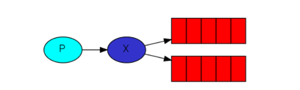
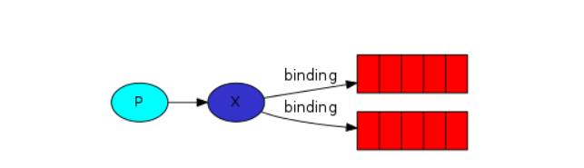

## 发布/订阅模型
   
1. 1个生产者，多个消费者
2. 每一个消费者都有自己的一个队列
3. 生产者没有将消息直接发送到队列，而是发送到了交换机
4. 每个队列都要绑定到交换机
5. 生产者发送的消息，经过交换机，到达队列，实现，一个消息被多个消费者获取的目的
::: warning
一个消费者队列可以有多个消费者实例，只有其中一个消费者实例会消费
:::

RabbitMQ消息传递模型中的核心思想是生产者从不将任何消息直接发送到队列。实际上，生产者经常甚至根本不知道是否将消息传递到任何队列。相反，生产者只能将消息发送到交换机。交换机是一件非常简单的事情。一方面，它接收来自生产者的消息，另一方面，将它们推入队列。交换机必须确切知道如何处理收到的消息。是否应将其附加到特定队列？是否应该将其附加到许多队列中？还是应该丢弃它。规则由交换类型定义

&emsp;  
有几种交换类型可用：direct，topic，headers 和fanout。本章集中讨论fanout类型，direct和topic会在后续内容钟进行讨论
::: tip
headers类型的交换机不依赖与路由键的匹配规则来路由消息，而是根据发送消息的内容中的headers属性进行匹配，在绑定队列和交换机时指定一组键值对，当发送消息到交换机时，rabbitmq会获取到消息的header(也是一个键值对的形式），对比其中的键值对是否完全匹配队列和交换机绑定时指定的键值对，如果完全匹配则消息会路由到该队列，否则不会路由到该队列，headers类型的交换机性能会很差，且不实用，不推荐使用
:::

**创建一个fanout类型的交换机**
```java
channel.exchangeDeclare("logs", "fanout");  // 交换机名为logs
```

## 匿名交换机
在简单队列和Work模式中，我们对交换机一无所知，但仍然能够将消息发送到队列。这是可能的，因为我们使用的是默认交换，我们通过空字符串（""）来进行标识。
```java
// 之前发布消息的代码
channel.basicPublish("", QUEUE_NAME, null, message.getBytes());
```
第一个参数是交换的名称。空字符串表示默认或匿名交换：消息将以routingKey指定的名称路由到队列（如果存在）

## 临时队列
在简单队列和Work模式中，我们使用的是具有特定名称的队列，能够命名队列对我们至关重要-我们需要将消费者指向同一队列。当您想在生产者和消费者之间共享队列时，给队列命名很重要。但这不是我们的logger的情况。我们希望听到所有日志消息，而不仅仅是其中的一部分。我们也只对当前正在发送的消息感兴趣，而对旧消息不感兴趣。为了解决这个问题，我们需要两件事

&emsp;  
首先，无论何时连接到Rabbit，我们都需要一个全新的空队列。为此，我们可以创建一个具有随机名称的队列，或者甚至更好-让服务器为我们选择一个随机队列名称。其次，一旦我们断开了使用者的连接，队列将被自动删除

&emsp;  
在Java客户端中，当我们不向queueDeclare（）提供任何参数时，我们将 使用生成的名称创建一个非持久的，排他的，自动删除的队列：
```java
String queueName = channel.queueDeclare().getQueue();
```

## 绑定
 
创建好交换机和队列之后，需要告诉交换机将消息发送到我们的队列，交换和队列之间的关系称为绑定
```java
channel.queueBind(queueName, "logs", "");
```

## 示例代码
**生产者**  
消息生产者的代码与之前并无太大不同，最重要的变化是我们现在希望将消息发布到logs交换机，而不是匿名的消息交换机。发送时，我们需要提供一个routingKey，但是对于fanout交换类型，它的值将被忽略
```java
public class EmitLog {

  private static final String EXCHANGE_NAME = "logs";

  public static void main(String[] argv) throws Exception {
    ConnectionFactory factory = new ConnectionFactory();
    factory.setHost("localhost");
    try (Connection connection = factory.newConnection();
         Channel channel = connection.createChannel()) {
        // 生命交换机
        channel.exchangeDeclare(EXCHANGE_NAME, "fanout");

        String message = argv.length < 1 ? "info: Hello World!" :
                            String.join(" ", argv);

        // 将消息发送到logs交换机
        channel.basicPublish(EXCHANGE_NAME, "", null, message.getBytes("UTF-8"));
        System.out.println(" [x] Sent '" + message + "'");
    }
  }
}
```
&emsp;  

**消费者**  
```java
public class ReceiveLogs {
  private static final String EXCHANGE_NAME = "logs";

  public static void main(String[] argv) throws Exception {
    ConnectionFactory factory = new ConnectionFactory();
    factory.setHost("localhost");
    Connection connection = factory.newConnection();
    Channel channel = connection.createChannel();

    channel.exchangeDeclare(EXCHANGE_NAME, "fanout");
    // 获取临时队列名
    String queueName = channel.queueDeclare().getQueue();
    // 绑定队列与交换机
    channel.queueBind(queueName, EXCHANGE_NAME, "");

    System.out.println(" [*] Waiting for messages. To exit press CTRL+C");

    DeliverCallback deliverCallback = (consumerTag, delivery) -> {
        String message = new String(delivery.getBody(), "UTF-8");
        System.out.println(" [x] Received '" + message + "'");
    };
    channel.basicConsume(queueName, true, deliverCallback, consumerTag -> { });
  }
}
```