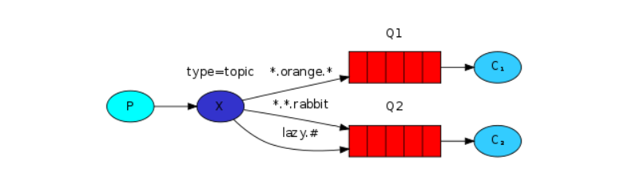

## Topic
尽管使用Direct交换对我们的系统进行了改进，但它仍然存在局限性：它不能基于多个条件进行路由。在我们的日志记录系统中，我们可能不仅要根据严重性订阅日志，还要根据发出日志的源订阅日志，比如在syslog unix工具中，根据严重性（info / warn / crit ...）和工具（auth / cron / kern ...）路由日志。这将为我们提供很大的灵活性-我们可能只想听听来自'cron'的严重错误，也可以听听'kern'的所有日志，这就需要用到主题交换

## Topic交换机
发送到主题交换的消息不能是任意的routing key -- 它必须是单词列表，以点分隔。这些词可以是任何东西，但通常它们指定与消息相关的某些功能。一些有效的路由关键示例：“ stock.usd.nyse ”，“ nyse.vmw ”，“ quick.orange.rabbit ”。路由密钥中可以包含任意多个单词，最多255个字节

&emsp;  
绑定键还必须采用相同的形式。Topic交换背后的逻辑类似于Direct交换的逻辑 ：使用特定路由键发送的消息将传递到所有使用匹配绑定键绑定的队列。但是，绑定键有两个重要的特殊情况：
* *（星号）可以代替一个单词
* ＃（哈希）可以替代零个或多个单词

   

::: tip
Topic交换功能强大，可以像其他交换机一样进行  
当一个队列用“ ＃ ”（哈希）绑定键绑定时，它将接收所有消息，而与路由键无关，就像在Fanout交换中一样  
当在绑定中不使用特殊字符“ * ”（星号）和“ ＃ ”（哈希）时，Topic交换的行为就像Direct的一样  
::: 

## 代码示例
**生产者**
```java
public class EmitLogTopic {

  private static final String EXCHANGE_NAME = "topic_logs";

  public static void main(String[] argv) throws Exception {
    ConnectionFactory factory = new ConnectionFactory();
    factory.setHost("localhost");
    try (Connection connection = factory.newConnection();
         Channel channel = connection.createChannel()) {

        channel.exchangeDeclare(EXCHANGE_NAME, "topic");

        String routingKey = getRouting(argv);
        String message = getMessage(argv);

        channel.basicPublish(EXCHANGE_NAME, routingKey, null, message.getBytes("UTF-8"));
        System.out.println(" [x] Sent '" + routingKey + "':'" + message + "'");
    }
  }
  //..
}
```

&emsp;    
**消费者**
```java
public class ReceiveLogsTopic {

  private static final String EXCHANGE_NAME = "topic_logs";

  public static void main(String[] argv) throws Exception {
    ConnectionFactory factory = new ConnectionFactory();
    factory.setHost("localhost");
    Connection connection = factory.newConnection();
    Channel channel = connection.createChannel();

    channel.exchangeDeclare(EXCHANGE_NAME, "topic");
    String queueName = channel.queueDeclare().getQueue();

    if (argv.length < 1) {
        System.err.println("Usage: ReceiveLogsTopic [binding_key]...");
        System.exit(1);
    }

    for (String bindingKey : argv) {
        channel.queueBind(queueName, EXCHANGE_NAME, bindingKey);
    }

    System.out.println(" [*] Waiting for messages. To exit press CTRL+C");

    DeliverCallback deliverCallback = (consumerTag, delivery) -> {
        String message = new String(delivery.getBody(), "UTF-8");
        System.out.println(" [x] Received '" +
            delivery.getEnvelope().getRoutingKey() + "':'" + message + "'");
    };
    channel.basicConsume(queueName, true, deliverCallback, consumerTag -> { });
  }
}
```