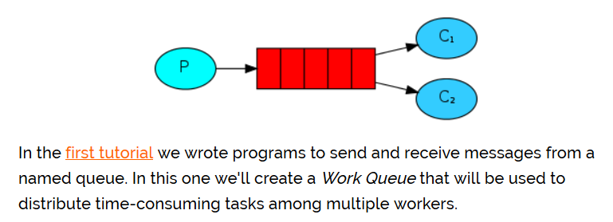

## Work模式
 
**一个生产者、多个消费者**  
**一个消息只能被一个消费者获取**  

&emsp;  
**生产者代码 NewTask.java**  
```java
public class NewTask {

    private final static String QUEUE_NAME = "hello";

    public static void main(String[] argv) throws Exception {
        ConnectionFactory factory = new ConnectionFactory();
        factory.setHost("localhost");
        // 使用了try-with-resource的语法糖
        try (
            Connection connection = factory.newConnection();
            Channel channel = connection.createChannel()) {
                channel.queueDeclare(QUEUE_NAME, false, false, false, null);
                String message = String.join(" ", argv);
                channel.basicPublish("", QUEUE_NAME, null
                    , message.getBytes(StandardCharsets.UTF_8));
                System.out.println(" [x] Sent '" + message + "'");
            }
    }
}
```
**消费者代码 Worker.java**  
```java
public class Worker {

    private final static String QUEUE_NAME = "hello";

    public static void main(String[] argv) throws Exception {
        ConnectionFactory factory = new ConnectionFactory();
        factory.setHost("localhost");
        Connection connection = factory.newConnection();
        Channel channel = connection.createChannel();

        channel.queueDeclare(QUEUE_NAME, false, false, false, null);
        System.out.println(" [*] Waiting for messages. To exit press CTRL+C");

        DeliverCallback deliverCallback = (consumerTag, delivery) -> {
            String message = new String(delivery.getBody(), "UTF-8");
            System.out.println(" [x] Received '" + message + "'");
            try {
                doWork(message);
            } finally {
                System.out.println("[x] Done");
            }
        };
        boolean autoAck = true;  // acknowledgment is covered below
        channel.basicConsume(QUEUE_NAME, autoAck, deliverCallback, consumerTag -> { });
    }

    // 模拟执行时间的假任务
    private static void doWork(String task) throws InterruptedException {
        for (char ch: task.toCharArray()) {
            if (ch == '.') Thread.sleep(1000);
        }
    }
}
```
可以使用控制台编译运行代码，产生一个NewTask和两个Worker，也可以将Worker的代码复制一份，使用IDE运行。使用NewTask发布任务，查看执行效果
```
java -cp $CP NewTask First message.
# => [x] Sent 'First message.'
java -cp $CP NewTask Second message..
# => [x] Sent 'Second message..'
java -cp $CP NewTask Third message...
# => [x] Sent 'Third message...'
java -cp $CP NewTask Fourth message....
# => [x] Sent 'Fourth message....'
java -cp $CP NewTask Fifth message.....
# => [x] Sent 'Fifth message.....'
```
```
# => [*] Waiting for messages. To exit press CTRL+C
# => [x] Received 'First message.'
# => [x] Received 'Third message...'
# => [x] Received 'Fifth message.....'
```
```
# => [*] Waiting for messages. To exit press CTRL+C
# => [x] Received 'Second message..'
# => [x] Received 'Fourth message....'
```
执行结果：
1. Worker1和Worker2获取到的消息是不同的，同一个消息只能被一个消费者获取
2. 消费者1和消费者2获取到的消息的数量是相同的，一个是消费奇数号消息，一个是偶数

**这种消息分发方式称为轮询分发**

## 公平分发
如果不考虑任务的执行情况而单纯的轮询分发可能会导致某一个任务分配不均，如果一个消费者执行任务的时长明显高于其它消费者的话，那么就会导致该消费者堆积着大量的任务而其它消费者处于空闲状态。为了克服这一点，我们可以将basicQos方法与 prefetchCount = 1设置一起使用。这告诉RabbitMQ一次不要给消费者一个以上的消息。换句话说，在处理并确认上一条消息之前，不要将新消息发送给消费者。而是将其分派给尚不繁忙的下一个消费者
```java
int prefetchCount = 1 ;
channel.basicQos（prefetchCount）;
```

## 消息确认
为了确保消息永不丢失，RabbitMQ支持消息确认。消费者发送回一个确认（acknowledgement），以告知RabbitMQ已经接收，处理了特定的消息，并且RabbitMQ可以自由删除它。如果使用者在不发送确认的情况下死亡（其通道已关闭，连接已关闭或TCP连接丢失），RabbitMQ将了解消息未完全处理，并将重新排队。如果同时有其他消费者在线，它将很快将其重新分发给另一位消费者。这样，即使消费者偶尔死亡，您也可以确保不会丢失任何消息

&emsp;  
没有任何消息超时；消费者死亡时，RabbitMQ将重新传递消息。即使处理一条消息花费非常非常长的时间也没关系。默认情况下，手动消息确认处于打开状态。在前面的示例中，我们通过autoAck = true 标志显式关闭了它们。一旦我们完成了一项任务，就该将该标志设置为false并从工作程序发送适当的确认的时候了
```java
boolean autoAck = false;  
```
这种情况下，可以确保，即使在处理消息时使用CTRL + C杀死消费者，也不会丢失任何信息。消费者死亡后不久，所有未确认的消息将重新发送

## 消息持久化
消息确认可以保证即使消费者死亡，任务也不会丢失。但是，如果RabbitMQ服务器停止，我们的任务仍然会丢失。RabbitMQ退出或崩溃时，它将忘记队列和消息，除非您告知不要这样做。要确保消息不会丢失，需要做两件事：我们需要将队列和消息都标记为持久性
```java
// 队列持久化
boolean durable = true;
channel.queueDeclare(QUEUE_NAME, durable, false, false, null);
```
```java
// 消息持久化
import com.rabbitmq.client.MessageProperties;

channel.basicPublish("", QUEUE_NAME,
            MessageProperties.PERSISTENT_TEXT_PLAIN,
            message.getBytes());
```