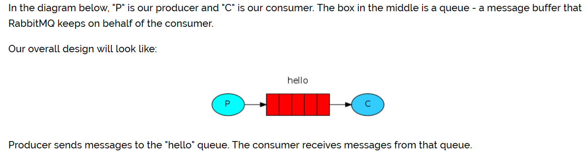

## 简单队列
  
**P：消息的生产者**  
**C：消息的消费者**  
**红色：队列**  
**生产者将消息发送到队列中，消费者从队列中获取消息**

&emsp;  
1. 导入RabbitMQ的客户端依赖
```
<!-- https://mvnrepository.com/artifact/com.rabbitmq/amqp-client -->
<dependency>
    <groupId>com.rabbitmq</groupId>
    <artifactId>amqp-client</artifactId>
    <version>5.8.0</version>
</dependency>
```
::: tip
本教程假定RabbitMQ 已在标准端口（5672）的本地主机上安装并运行。如果您使用其他主机，端口或凭据，则连接设置需要进行调整
:::

&emsp;  
2. 生产者发送消息到队列
```java
import com.rabbitmq.client.Channel;
import com.rabbitmq.client.Connection;
import com.rabbitmq.client.ConnectionFactory;

import java.nio.charset.StandardCharsets;

public class Send {

    private final static String QUEUE_NAME = "hello";

    public static void main(String[] argv) throws Exception {
        ConnectionFactory factory = new ConnectionFactory();
        factory.setHost("localhost");
        // 使用了try-with-resource的语法糖
        try (
            Connection connection = factory.newConnection();
            Channel channel = connection.createChannel()) {
                channel.queueDeclare(QUEUE_NAME, false, false, false, null);
                String message = "Hello World!";
                channel.basicPublish("", QUEUE_NAME, null, message.getBytes(StandardCharsets.UTF_8));
                System.out.println(" [x] Sent '" + message + "'");
            }
    }
}
```

&emsp;  
3. 消费者从队列中获取消息
```java
import com.rabbitmq.client.Channel;
import com.rabbitmq.client.Connection;
import com.rabbitmq.client.ConnectionFactory;
import com.rabbitmq.client.DeliverCallback;

public class Recv {

    private final static String QUEUE_NAME = "hello";

    public static void main(String[] argv) throws Exception {
        ConnectionFactory factory = new ConnectionFactory();
        factory.setHost("localhost");
        Connection connection = factory.newConnection();
        Channel channel = connection.createChannel();

        channel.queueDeclare(QUEUE_NAME, false, false, false, null);
        System.out.println(" [*] Waiting for messages. To exit press CTRL+C");

        DeliverCallback deliverCallback = (consumerTag, delivery) -> {
            String message = new String(delivery.getBody(), "UTF-8");
            System.out.println(" [x] Received '" + message + "'");
        };
        channel.basicConsume(QUEUE_NAME, true, deliverCallback, consumerTag -> { });
    }
}
```