## 下载
下载地址：http://www.rabbitmq.com/download.html

## Windows下安装
### 1.安装Erlang
下载：http://www.erlang.org/download/otp_win64_17.3.exe  
安装：  
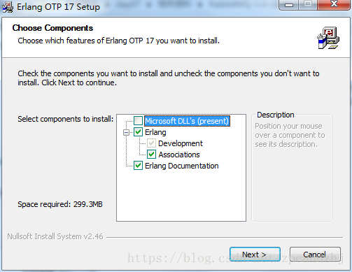
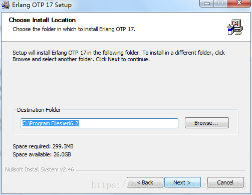
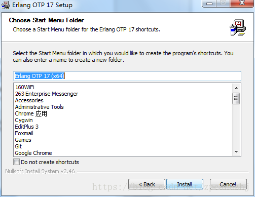
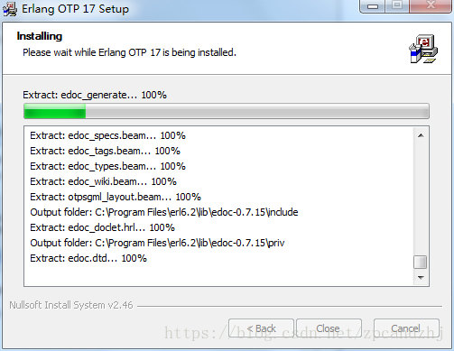
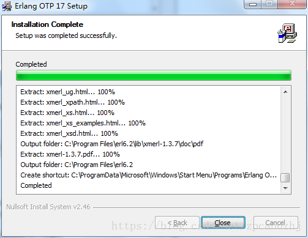  
安装完成

### 2.安装RabbitMQ
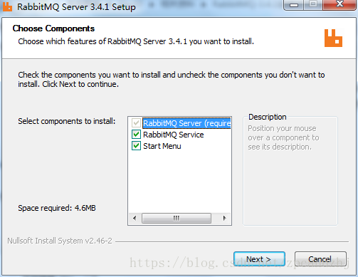  
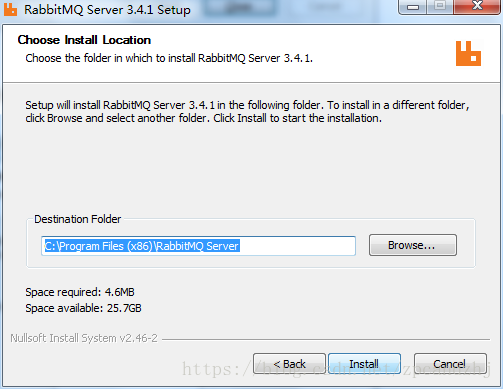  
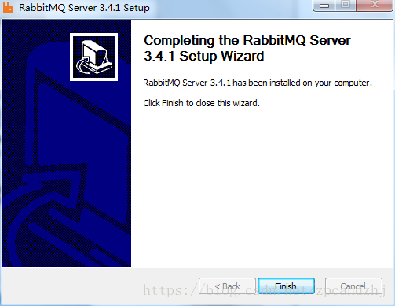  
安装完成  
开始菜单里出现如下选项：
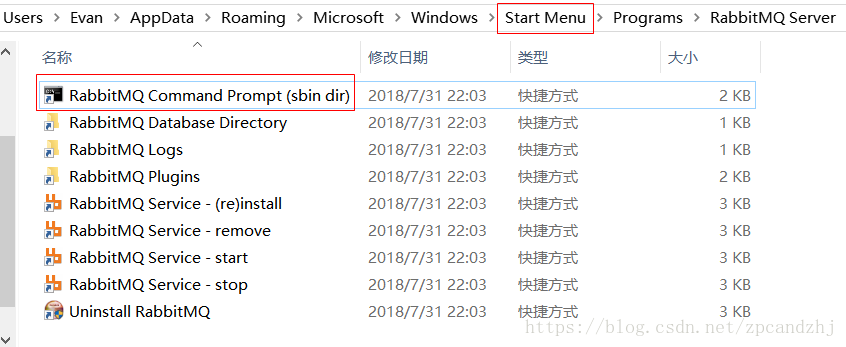  
启动、停止、重新安装等

### 3.启用管理工具
1. 双击RabbitMQ Command Prompt(sbin dir)
2. 进入C:\安装路径\sbin 输入指令：rabbitmq-plugins enable rabbitmq_management
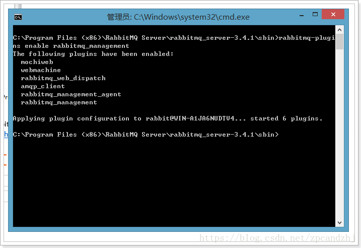  
这样就启动了管理工具，可以试一下命令：
   * 停止：net stop RabbitMQ
   * 启动：net start RabbitMQ  
3. 在浏览器中输入地址查看：http://127.0.0.1:15672/  
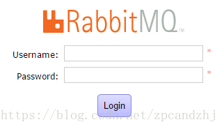 
4. 使用默认账号登录：guest/ guest
5. 添加admin用户
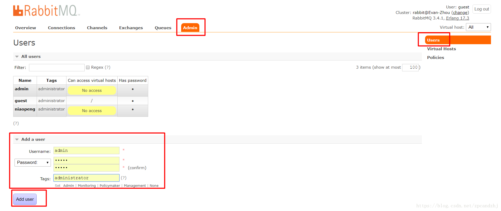   
超级管理员(administrator)：可登陆管理控制台，可查看所有的信息，并且可以对用户，策略(policy)进行操作  
监控者(monitoring)：可登陆管理控制台，同时可以查看rabbitmq节点的相关信息(进程数，内存使用情况，磁盘使用情况等)  
策略制定者(policymaker)：可登陆管理控制台, 同时可以对policy进行管理。但无法查看节点的相关信息(上图红框标识的部分)  
普通管理者(management)：仅可登陆管理控制台，无法看到节点信息，也无法对策略进行管理  
其他：无法登陆管理控制台，通常就是普通的生产者和消费者
6. 创建Virtual Hosts
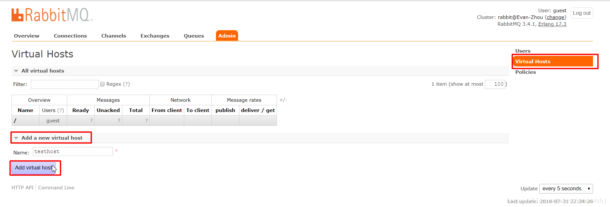   
选中Admin用户，设置权限：  
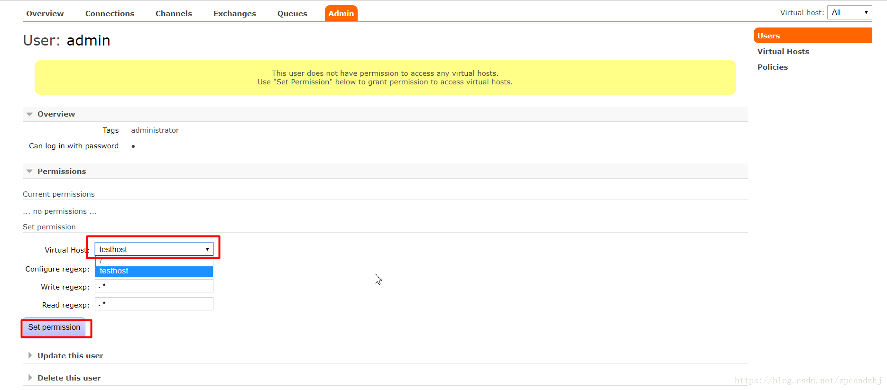  
看到权限已加：  
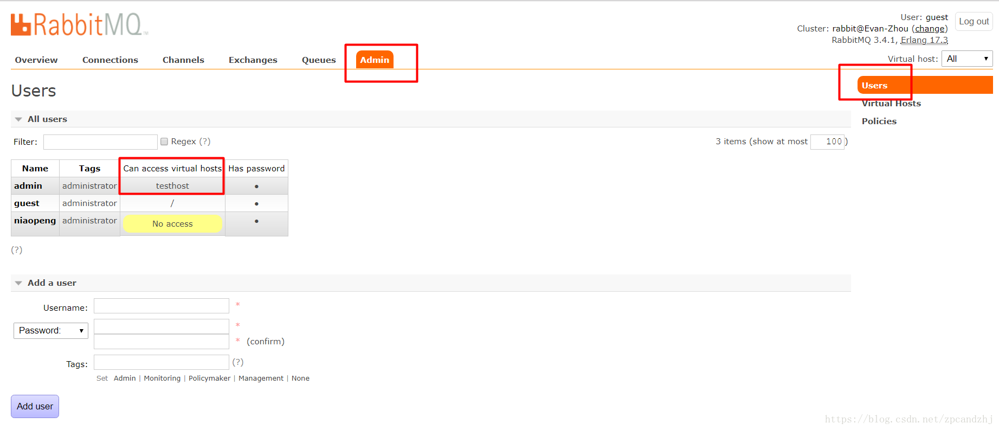  
7. 管理界面中的功能
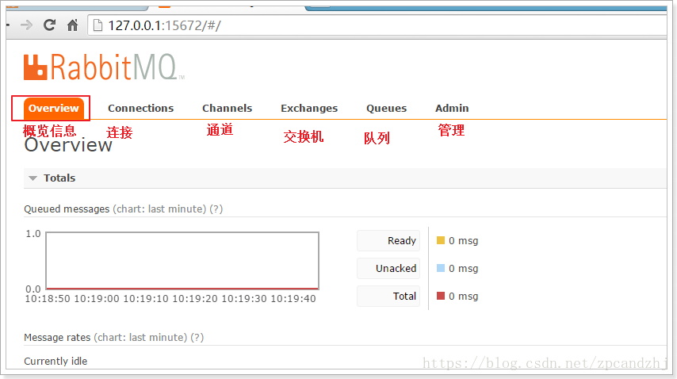  
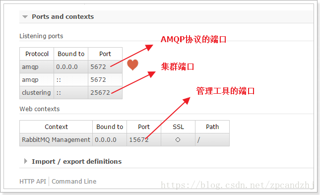  
 
## Linux下安装
### 1.安装Erlang
安装GCC GCC-C++ Openssl等模块  
```
yum -y install make gcc gcc-c++ kernel-devel m4 ncurses-devel openssl-devel
```
安装ncurses  
```
yum -y install ncurses-devel
```
安装erlang环境  
```
wget http://erlang.org/download/otp_src_18.2.1.tar.gz
tar xvfz otp_src_18.2.1.tar.gz 
./configure 
make install
```
### 2.安装RabbitMQ
下载rabbitmq-server-3.6.9.tar.xz  
```
wget http://www.rabbitmq.com/releases/rabbitmq-server/v3.6.9/rabbitmq-server-generic-unix-3.6.9.tar.xz
```
对于下载xz包进行解压，首先先下载xz压缩工具：  
```
yum install xz
```
对rabbitmq包进行解压：
```
xz -d xz -d rabbitmq-server-generic-unix-3.6.9.tar.xz
tar -xvf rabbitmq-server-generic-unix-3.6.9.tar
```
随后移动至/usr/local/下 改名rabbitmq：
```
cp -r rabbitmq_server-3.6.9 /usr/local/rabbitmq
```
这种下载方式解压后直接可以使用，无需再编译安装；  
进入到rabbit文件内，其命令文件存在于sbin文件夹下，因此需要将sbin文件夹的路径添加到PATH钟：修改/etc/profile
```
export PATH=/usr/local/rabbitmq/sbin:$PATH
```
执行source /etc/profile使得PATH路径更新，RabbitMQ安装成功  
随后启用MQ管理方式：
```
rabbitmq-plugins enable rabbitmq_management   #启动后台管理
rabbitmq-server -detached   #后台运行rabbitmq
```
设置端口号，可供外部访问：
```
iptables -I INPUT -p tcp --dport 15672 -j ACCEPT
```
添加用户和权限  
默认网页guest用户是不允许访问的，需要增加一个用户修改一下权限，代码如下：  
```
添加用户:rabbitmqctl add_user admin admin
添加权限:rabbitmqctl set_permissions -p "/" admin ".*" ".*" ".*"
修改用户角色:rabbitmqctl set_user_tags admin administrator
```
然后就可以远程访问了，然后可直接配置用户权限等信息