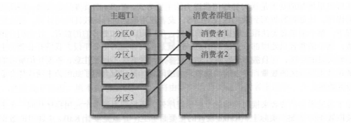
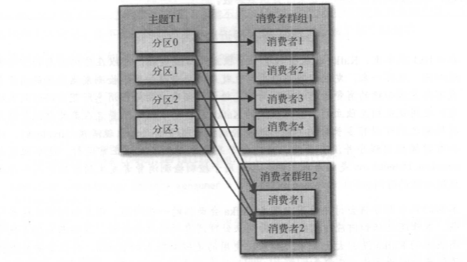

## KafkaConsumer概念
### 消费者和消费者群组
Kafka消费者从属于消费者群组。一个群组里的消费者订阅的是同一个主题，每个消费者接收主题一部分分区的消息  
     
往群组里增加消费者是横向伸缩消费能力的主要方式，不过要注意，不要让消费者的数量超过主题分区的数量，多余的消费者只会被闲置

&emsp;  
除了通过增加消费者来横向伸缩单个应用程序外，还经常出现多个应用程序从同一个主题读取数据的情况。实际上，Kafka设计的主要目标之一，就是要让Kafka主题里的数据能够满足企业各种应用场景的需求。在这些场景里，每个应用程序可以获取到所有的消息，而不只是其中的一部分。只要保证每个应用程序有自己的消费者群组，就可以让它们获取到主题所有的消息。不同于传统的消息系统，横向伸缩Kafk 消费者和消费者群组并不会对性能造成负面影响
   
简而言之，为每一个需要获取一个或多个主题全部消息的应用程序创建一个消费者群组，然后往群组里添加消费者来伸缩读取能力和处理能力，群组里的每个消费者只处理一部分消息

### 消费者群组和分区再均衡
分区的所有权从一个消费者转移到另一个消费者，这样的行为被称为再均衡。再均衡非常重要，它为消费者群组带来了高可用性和伸缩性（我们可以放心地添加或移除消费者），不过在正常情况下，我们并不希望发生这样的行为。在再均衡期间，消费者无法读取消息，造成整个群组一小段时间的不可用。另外，当分区被重新分配给另一个消费者时，消费者当前的读取状态会丢失，它有可能还需要去刷新缓存，在它重新恢复状态之前会拖慢 应用程序

&emsp;  
消费者通过向被指派为群组协调器的broker（不同的群组可以有不同的协调器）发送心跳来维持它们和群组的从属关系以及它们对分区的所有权关系。只要消费者以正常的时间间隔发送心跳，就被认为是活跃的，说明它还在读取分区里的消息。消费者会在轮询消息（为了获取消息）或提交偏移量时发送心跳。如果消费者停止发送心跳的时间足够长，会话就会过期，群组协调器认为它已经死亡，就会触发一次再均衡

&emsp;  
如果一个消费者发生崩溃，并停止读取消息，群组协调器会等待几秒钟，确认它死亡了才会触发再均衡。在这几秒钟时间里，死掉的消费者不会读取分区里的消息。在清理消费者时，消费者会通知协调器它将要离开群组，协调器会立即触发一次再均衡，尽量降低处理停顿

## 创建Kafka消费者
```java
Properties props = new Properties();
// 指定kafka集群的连接字符串
props.put("bootstrap.servers", "broker1:9092, broker2:9092");
// 指定消费者属于哪个集群，非必需，但是基本上都会指定
props.put("group.id", "CountryCounter");
// 指定反序列化器
props.put("key.serializer", "org.apache.kafka.common.serialization.StringDeserializer");
props.put("value.serializer", "org.apache.kafka.common.serialization.StringDeserializer");

KafkaConsumer<String, String> consumer = new KafkaConsumer<String, String>(props);
```

## 订阅主题
创建好消费者之后，下一步可以开始订阅主题了。 subscribe()方法接受一个主题列表作为参数:
```java
consumer.subscribe(Collections.singletonList("consumerCountries"));
```
我们也可以在调用subscribe()方法时传入一个正则表达式。正则表达式可以匹配多个主题， 如果有人创建了新的主题，并且主题的名字与正则表达式匹配，那么会立即触发一次再均衡，消费者就可以读取新添加的主题。如果应用程序需要读取多个主题，并且可以处理不同类型的数据，那么这种订阅方式就很管用。在Kafka和其他系统之间复制数据时 使用正则表达式的方式订阅多个主题是很常见的做法

&emsp;  
要订阅所有与test相关的主题，可以这样做：
```java
consumer.subscribe("test.*");
```
