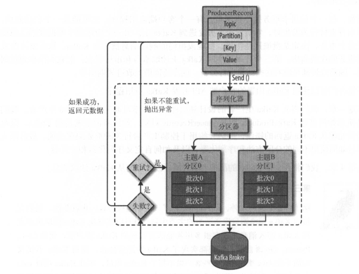

## 生产者概览
 

我们从创建一个ProducerRecord对象开始，ProducerRecord对象需要包含目标主题和要发送的内容。我们还可以指定键或分区。在发送ProducerRecord对象时，生产者要先把键和值对象序列化成字节数组，这样它们才能够在网络上传输

&emsp;  
接下来，数据被传给分区器。如果之前在ProducerRecord对象里指定了分区，那么分区器就不会再做任何事情，直接把指定的分区返回。如果没有指定分区，那么分区器会根据ProducerRecord对象的键来选择一个分区。选好分区以后，生产者就知道该往哪个主题和分区发送这条记录了。紧接着，这条记录被添加到一个记录批次里，这个批次里的所有消息会被发送到相同的主题和分区上。有一个独立的线程负责把这些记录批次发送到相应的broker上

&emsp;  
服务器在收到这些消息时会返回一个响应。如果消息成功写入Kafka，就返回一个RecordMetaData对象，它包含了主题和分区信息，以及记录在分区里的偏移量。如果写入失败，则会返回一个错误。生产者在收到错误之后会尝试重新发送消息，几次之后如果还是失败，就返回错误信息

## 创建Kafka生产者
要往Kafka写入消息，首先要创建一个生产者对象，并设置一些属性。Kafka生产者有3个必选的属性：
* bootstrap.servers  
  该属性指定broker的地址清单，地址的格式 host:port。清单里不需要包含所有的broker地址，生产者会从给定的broker里查找到其他 broker的信息。不过建议至少要提供两个broker的信息，一且其中一个宕机，生产者仍然能够连接到集群上

* key.seriable  
  broker希望接收到的消息的键和值都是字节数组。生产者接口允许使用参数化类型，因此可以把Java对象作为键和值发送给broker。这样的代码具有良好的可读性，不过生产者需要知道如何把这些Java对象转换成字节数组。key.seriable必须被设置为一个实现了org.apache.kafka.common.serialization.Serializer接口的类，生产者会使用这个类把键对象序列化成字节数组。Kafka客户端默认提供了ByteArraySerilizer（这个只做很少的事情）、 StringSerilizer和 IntegerSerilizer，因此，如果你只使用常见的几种Java对象类型，那么就没必要实现自己的序列化器。要注意，key.seriable是必须设置的，就算你打算只发送值内容

* value.serilizer  
  与key.serilizer一样，value.serilizer指定的类会将值序列化。如果键和值都是字符串，可以使用与key.serilizer一样的序列化器。如果键是整数类型而值是字符串 ，那么需要使用不同的序列化器

&emsp;  
以下代码片段演示了如何创建一个新的生产者，这里只指定了必要的属性，其它的使用默认配置
```java
// 新建一个Properties对象
private Properties kafkaProps = new Properties();
kafkaProps.put("bootstrap.servers", "broker1:9092, broker2:9092");
// 打算把key和value定义成String类型，所以使用内置的StringSerilizer
kafkaProps.put("key.serilizer", "org.apache.kafka.common.serialization.StringSerilizer");
kafkaProps.put("value.serilizer", "org.apache.kafka.common.serialization.StringSerilizer");
// 新建一个生产者对象
producer = new KafkaProducer<String, String>(kafkaProps);
```

&emsp;  
实例化生产者对象后，接下来就可以开始发送消息了。发送消息主要有以下3种方式:
* 发送并忘记（fire-and-forget)   
  我们把消息发送给服务器，但并不关心它是否正常到达。大多数情况下，消息会正常到达，因为Kafka是高可用的，而且生产者会自动尝试重发。不过，使用这种方式有时候 也会丢失一些消息
* 同步发送  
  我们使用send()方怯发送消息，它会返回一个Future对象，调用get()方法进行等待，就可以知道消息是否发送成功
* 异步发送  
  我们调用send()方怯，并指定一个回调函数，服务器在返回响应时调用该函数

&emsp;  
本章的所有例子都使用单线程，但其实生产者是可以使用多线程来发送消息的。刚开始的时候可以使用单个消费者和单个线程。如果需要更高的吞吐量，可以在生产者数量不变的前提下增加线程数量。如果这样做还不够，可以增加生产者数量

## 发送消息到Kafka
最简单的消息发送方式如下所示：
```java
// 创建一个ProducerRecord对象。这里使用其中一个构造函数，它需要目标主题的名字和要发送的键和
// 值对象，它们都是字符串。键和值对象的类型必须与序列化器和生产者对象相匹配
ProducerRecord<String, String> record = new ProducerRecord<>("CustomerCountry",
   "Precision Products", "France");
try {
  // 使用生产者的send()方越发送ProducerRecord对象。消息先是被放进缓冲区，然后使用单独的线
  // 程发送到服务器端。send()方法会返回一个包含 ProducerRecord的Future对象，不过因为我们会
  // 忽略返回值
  producer.send(record);
} catch (Exception e) {
  // 可以忽略发送消息时可能发生的错误或在服务器端可能发生的错误，但在发送消息之前，生产者
  // 还是有可能发生其他的异常
  e.printStackTrace();
}
```

### 同步发送消息
最简单的同步消息发送方式如下所示：
```java
ProducerRecord<String, String> record = new ProducerRecord<>("CustomerCountry"
  , "Precision Products", "France");
try {
  // producer.send()方住先返回一个Future对象，然后调用Future 象的get()方法等待Kafka响应。
  // 如果服务器返回错误，get()方法会抛出异常。如果没有发生错误，我们会得到一个
  // RecordMetadata对象，可以用它获取消息的偏移量
  producer.send(record).get();
} catch (Exception e) {
  // 如果在发送数据之前或者在发送过程中发生了任何错误，比如broker返回了一个不允许重发消息
  // 的异常或者已经超过了重发的次数，那么就会抛出异常
  e.printStackTrace();
}
```
KafkaProducer一般会发生两类错误。其中一类是可重试错误，这类错误可以通过重发消息来解决。比如对于连接错误，可以通过再次建立连接来解决，“无主（no leader）” 错误则可以通过重新为分区选举首领来解决。KafkaProducer可以被配置成自动重试，如果在多次重试后仍无能解决问题，应用程序会收到一个重试异常。另一类错误无出通过重试解决，比如 “消息太大”异常。对于这类错误，KafkaProducer不会进行任何重试，直接抛出异常

### 异步发送消息
为了在异步发送消息的同时能够对异常情况进行处理，生产者提供了回调支持。下面是使用回调的一个例子
```java
// 为了使用回调，需要一个实现了org.apache.kafka.clients.producer.Callback接口的类，这个
// 类只有一个onCompletion方法
private class DemoProducerCallback implements Callback {
  @Override
  public void onCompletion(RecordMetadata recordMetadata, Exception e) {
    // 如果Kafka返回一个错误，onCompletion会抛出一个非空异常
    if (e != null) {
      e.printStackTrace();
    }
  }
}

ProducerRecord<String, String> record = new ProducerRecord<>("CustomerCountry"
  , "Biomedical Materials", "USA");
// 发送消息时传入一个会调对象
producer.send(record, new DemoProducerCallback());
```

