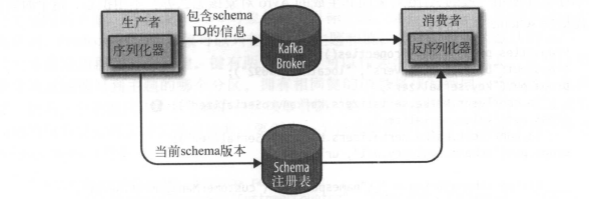

## 生产者概览
 

我们从创建一个ProducerRecord对象开始，ProducerRecord对象需要包含目标主题和要发送的内容。我们还可以指定键或分区。在发送ProducerRecord对象时，生产者要先把键和值对象序列化成字节数组，这样它们才能够在网络上传输

&emsp;  
接下来，数据被传给分区器。如果之前在ProducerRecord对象里指定了分区，那么分区器就不会再做任何事情，直接把指定的分区返回。如果没有指定分区，那么分区器会根据ProducerRecord对象的键来选择一个分区。选好分区以后，生产者就知道该往哪个主题和分区发送这条记录了。紧接着，这条记录被添加到一个记录批次里，这个批次里的所有消息会被发送到相同的主题和分区上。有一个独立的线程负责把这些记录批次发送到相应的broker上

&emsp;  
服务器在收到这些消息时会返回一个响应。如果消息成功写入Kafka，就返回一个RecordMetaData对象，它包含了主题和分区信息，以及记录在分区里的偏移量。如果写入失败，则会返回一个错误。生产者在收到错误之后会尝试重新发送消息，几次之后如果还是失败，就返回错误信息

## 创建Kafka生产者
要往Kafka写入消息，首先要创建一个生产者对象，并设置一些属性。Kafka生产者有3个必选的属性：
* bootstrap.servers  
  该属性指定broker的地址清单，地址的格式 host:port。清单里不需要包含所有的broker地址，生产者会从给定的broker里查找到其他 broker的信息。不过建议至少要提供两个broker的信息，一且其中一个宕机，生产者仍然能够连接到集群上

* key.seriable  
  broker希望接收到的消息的键和值都是字节数组。生产者接口允许使用参数化类型，因此可以把Java对象作为键和值发送给broker。这样的代码具有良好的可读性，不过生产者需要知道如何把这些Java对象转换成字节数组。key.seriable必须被设置为一个实现了org.apache.kafka.common.serialization.Serializer接口的类，生产者会使用这个类把键对象序列化成字节数组。Kafka客户端默认提供了ByteArraySerilizer（这个只做很少的事情）、 StringSerilizer和 IntegerSerilizer，因此，如果你只使用常见的几种Java对象类型，那么就没必要实现自己的序列化器。要注意，key.seriable是必须设置的，就算你打算只发送值内容

* value.serilizer  
  与key.serilizer一样，value.serilizer指定的类会将值序列化。如果键和值都是字符串，可以使用与key.serilizer一样的序列化器。如果键是整数类型而值是字符串 ，那么需要使用不同的序列化器

&emsp;  
以下代码片段演示了如何创建一个新的生产者，这里只指定了必要的属性，其它的使用默认配置
```java
// 新建一个Properties对象
private Properties kafkaProps = new Properties();
kafkaProps.put("bootstrap.servers", "broker1:9092, broker2:9092");
// 打算把key和value定义成String类型，所以使用内置的StringSerilizer
kafkaProps.put("key.serilizer", "org.apache.kafka.common.serialization.StringSerilizer");
kafkaProps.put("value.serilizer", "org.apache.kafka.common.serialization.StringSerilizer");
// 新建一个生产者对象
producer = new KafkaProducer<String, String>(kafkaProps);
```

&emsp;  
实例化生产者对象后，接下来就可以开始发送消息了。发送消息主要有以下3种方式:
* 发送并忘记（fire-and-forget)   
  我们把消息发送给服务器，但并不关心它是否正常到达。大多数情况下，消息会正常到达，因为Kafka是高可用的，而且生产者会自动尝试重发。不过，使用这种方式有时候 也会丢失一些消息
* 同步发送  
  我们使用send()方怯发送消息，它会返回一个Future对象，调用get()方法进行等待，就可以知道消息是否发送成功
* 异步发送  
  我们调用send()方怯，并指定一个回调函数，服务器在返回响应时调用该函数

&emsp;  
本章的所有例子都使用单线程，但其实生产者是可以使用多线程来发送消息的。刚开始的时候可以使用单个消费者和单个线程。如果需要更高的吞吐量，可以在生产者数量不变的前提下增加线程数量。如果这样做还不够，可以增加生产者数量

## 发送消息到Kafka
最简单的消息发送方式如下所示：
```java
// 创建一个ProducerRecord对象。这里使用其中一个构造函数，它需要目标主题的名字和要发送的键和
// 值对象，它们都是字符串。键和值对象的类型必须与序列化器和生产者对象相匹配
ProducerRecord<String, String> record = new ProducerRecord<>("CustomerCountry",
   "Precision Products", "France");
try {
  // 使用生产者的send()方越发送ProducerRecord对象。消息先是被放进缓冲区，然后使用单独的线
  // 程发送到服务器端。send()方法会返回一个包含 ProducerRecord的Future对象，不过因为我们会
  // 忽略返回值
  producer.send(record);
} catch (Exception e) {
  // 可以忽略发送消息时可能发生的错误或在服务器端可能发生的错误，但在发送消息之前，生产者
  // 还是有可能发生其他的异常
  e.printStackTrace();
}
```

### 同步发送消息
最简单的同步消息发送方式如下所示：
```java
ProducerRecord<String, String> record = new ProducerRecord<>("CustomerCountry"
  , "Precision Products", "France");
try {
  // producer.send()方住先返回一个Future对象，然后调用Future 象的get()方法等待Kafka响应。
  // 如果服务器返回错误，get()方法会抛出异常。如果没有发生错误，我们会得到一个
  // RecordMetadata对象，可以用它获取消息的偏移量
  producer.send(record).get();
} catch (Exception e) {
  // 如果在发送数据之前或者在发送过程中发生了任何错误，比如broker返回了一个不允许重发消息
  // 的异常或者已经超过了重发的次数，那么就会抛出异常
  e.printStackTrace();
}
```
KafkaProducer一般会发生两类错误。其中一类是可重试错误，这类错误可以通过重发消息来解决。比如对于连接错误，可以通过再次建立连接来解决，“无主（no leader）” 错误则可以通过重新为分区选举首领来解决。KafkaProducer可以被配置成自动重试，如果在多次重试后仍无能解决问题，应用程序会收到一个重试异常。另一类错误无出通过重试解决，比如 “消息太大”异常。对于这类错误，KafkaProducer不会进行任何重试，直接抛出异常

### 异步发送消息
为了在异步发送消息的同时能够对异常情况进行处理，生产者提供了回调支持。下面是使用回调的一个例子
```java
// 为了使用回调，需要一个实现了org.apache.kafka.clients.producer.Callback接口的类，这个
// 类只有一个onCompletion方法
private class DemoProducerCallback implements Callback {
  @Override
  public void onCompletion(RecordMetadata recordMetadata, Exception e) {
    // 如果Kafka返回一个错误，onCompletion会抛出一个非空异常
    if (e != null) {
      e.printStackTrace();
    }
  }
}

ProducerRecord<String, String> record = new ProducerRecord<>("CustomerCountry"
  , "Biomedical Materials", "USA");
// 发送消息时传入一个会调对象
producer.send(record, new DemoProducerCallback());
```

## 生产者的配置
生产者还有很多可配置的参数，在Kafka文档里都有说明，它们大部分都有合理的默认值，所以没有必要去修改它们。不过有几个参数在内存使用、性能和可靠性方面对生产者影响比较大，接下来我们会一一说明

### acks
acks参数指定了必须要有多少个分区副本收到消息，生产者才会认为消息写入是成功的。这个参数对消息丢失的可能性有重要影响。该参数有如下选项
* 如果acks=0，生产者在成功写入消息之前不会等待任何来自服务器的响应。这种方式可能会存在消息丢失，但是有很高的吞吐量
* 如果acks=1，只要集群的首领节点收到消息，生产者就会收到一个来自服务器的成功响应。如果消息无法到达首领节点， 生产者会收到一个错误响应，为了避免数据丢失，生产者会重发消息。不过，如果一个没有收到消息的节点成为新首领，消息还是会丢失。这个时候的吞吐量取决于使
同步发送还是异步发送
* 如果acks=all，只有当所有参与复制的节点全部收到消息时，生产者才会收到一个来自服务器的成功响应。这种模式是最安全的，它可以保证不止一个服务器收到消息，就算有服务器发生崩溃，整个集群仍然可以运行,但是延迟较高

### buffer.memory
该参数用来设置生产者内存缓冲区的大小，生产者用它缓冲要发送到服务器的消息。如果应用程序发送消息的速度超过发送到服务器的速度，会导致生产者空间不足。这个时候，send()方法调用要么被阻塞，要么抛出异常，取决于如何设置block.on.buffer.full（在 0.9.0.0 版本里被替换成了max.block.ms，表示在抛出异常之前可以阻塞一段时间）

### compression.type
默认情况下，消息发送时不会被压缩。该参数可以设置为 snappy、 gzip或lz4，它指定了消息被发送给broker之前使用哪一种压缩算也进行压缩

### retries
生产者从服务器收到的错误有可能是临时性的错误（比如分区找不到首领）。在这种情况下，retries参数的值决定了生产者可以重发消息的次数，如果达到这个次数，生产者会放弃重试并返回错误。默认情况下，生产者会在每次重试之间等待100ms，不过可以通过retry.backoff.ms参数来改变这个时间间隔

### batch.size
当有多个消息需要被发送到同一个分区时，生产者会把它们放在同一个批次里。该参数指定了一个批次可以使用的内存大小，按照字节数计算（而不是消息个数）。当批次被填满， 批次里的所有消息会被发送出去。不过生产者井不一定都会等到批次被填满才发送，半满的批次，甚至只包含一个消息的批次也有可能被发送。所以就算把批次大小设置得很大，也不会造成延迟，只是会占用更多的内存而已。但如果设置得太小，因为生产者需要更频繁地发送消息，会增加一些额外的开销

### linger.ms
该参数指定了生产者在发送批次之前等待更多消息加入批次的时间。 KafkaProducer会在批次填满或linger.ms达到上限时把批次发送出去。默认情况下，只要有可用的线程， 生产者就会把消息发送出去，就算批次里只有一个消息。把linger.ms设置成比0 的数，让生产者在发送批次之前等待一会儿，使更多的消息加入到这个批次。虽然这样会增加延迟，但也会提升吞吐量

### client.id
该参数可以是任意的字符串，服务器会用它来识别消息的来源，还可以用在日志和配额指标里

### max.in.flight.requests.per.connection
该参数指定了生产者在收到服务器晌应之前可以发送多少个消息。它的值越高，就会占用越多的内存，不过也会提升吞吐量。把它设为1可以保证消息是按照发送的顺序写入服务器的，即使发生了重试

### timeout.ms、request.timeout.ms和metadata.fetch.timeout.ms
request.timeout.ms指定了生产者在发送数据时等待服务器返回响应的时间，metadata.fetch.timeout.ms指定了生产者在获取元数据（比如目标分区的首领是谁）时等待服务器返回响应的时间。如果等待响应超时，那么生产者要么重试发送数据，要么返回一个错误 （抛出异常或执行回调）。timeout.ms指定了broker等待同步副本返回消息确认的时间，与asks的配置相匹配一一如果在指定时间内没有收到同步副本的确认，那么 broker就会返回一个错误

### max.block.ms
该参数指定了在调用send()方法或使用partitionsFor方法获取元数据时生产者的阻塞时间。当生产者的发送缓冲区已满，或者没有可用的元数据时，这些方法就会阻塞。在阻塞时间达到max.block.ms时，生产者会抛出超时异常

### max.request.size
该参数用于控制生产者发送的请求大小。它可以指能发送的单个消息的最大值，也可以指单个请求里所有消息总的大小。broker对可接收的消息最大值也有自己的限制（message.max.bytes），所以两边的配置最好可以匹配，避免生产者发送的消息被broker拒绝

### receive.buffer.bytes和send.buffer.bytes
这两个参数分别指定了TCP socket接收和发送数据包的缓冲区大小。如果它们被设为-1 , 就使用操作系统的默认值。如果生产者或消费者与broker处于不同的数据中心，那么可以适当增大这些值，因为跨数据中心的网络一般都有比较高的延迟和比较低的带宽

## 序列化器
### 自定义序列化器
如果发送到Kafka的对象不是简单的字符串或整型，那么可以使用序列化框架来创建消息记录，如Avro、Thrift或Protobuf，或者使用自定义序列化器。我们强烈建议使用通用的序列化框架。在此之前我们先通过一个自定义序列化器来了解其工作原理

&emsp;  
假如创建了一个简单的类来表示一个客户：
```java
public class Customer {
  private int customerID;
  private String customerName;

  // 省略getter、setter和构造方法
}
```
现在我们要为这个类创建一个序列化器，它看起来可能是这样的：
```java
public class CustomerSerializer implements Serializer<Customer> {
  @Override
  public void configure(Map configs, boolean isKey) {
    // 不做任何配置
  }

  @Override
  /**
  Customer对象被序列化成：
  表示CustomerID的4字节整数
  表示CustomerName长度的4字节整数（如果CustomerName为空，则长度为0）
  表示CustomerName的N个字节
  */
  public byte[] serialize(String topic, Customer data) {
    try {
      byte[] serializedName;
      int stringSize;
      if (data == null) {
        return null;
      } else {
        if (data.getName() != null) {
          serializedName = data.getName().getBytes("UTF-8");
          stringSize = serializedName.length;
        } else {
          serializedName = new byte[0];
          stringSize = 0;
        }
      }
      ByteBuffer buffer = ByteBuffer.allocate(4 + 4 + stringSize);
      buffer.putInt(data.getID());
      buffer.putInt(stringSize);
      buffer.put(serializedName);
      return buffer.array();
    } catch (Exception e) {
      throw new SerializationException("Serializing Error" + e);
    }

    @Override
    public void close() {
      // 不需要关闭任何东西
    }
  }
}
```
这个序列化器太过脆弱，如果Customer字段发生改变，那我序列化和反序列化就可能会出现新旧消息的兼容问题，而且如果序列化器发生改变，那么调用这个序列化器的地方都要更改代码。因此，我们不建议使用自定义序列化器，而是使用已有的序列化器和反序列化器，比如JSON、Avro、Thrift或 Protobuf

### 使用Avro序列化
Apache  Avro （以下简称 Avro）是一种与编程语言无关的序列化格式。 Doug Cutting创建了这个项目，目的是提供一种共享数据文件的方式。 Avro数据通过与语言无关的schema来定义。schema通过 JSON来描述，数据被序列化成二进制文件或JSON文件，不过一般会使用二进制文件。 Avro在读写文件时需要用到schema, schema一般会被内嵌在数据文件里。 Avro有一个很有意思的特性是，当负责写消息的应用程序使用了新的schema，负责读消息的应用程序可以继续处理消息而无需做任何改动，这个特性使得它特别适合用在像Kafka这样的消息系统上

&emsp;  
假设最初的schema是这样的：
```json
{
  "namespace": "customerManagement.avro",
  "type": "record",
  "name": "Customer",
  "fields": [
    {"name": "id", "type":"int"},
    {"name": "name", "type": "string"},
    {"name": "faxNumber", "type": ["null", "string"], "default": "null"}
  ]
}
```
之后我们将faxNumber变成了email字段：
```json
{"name": "email", "type": ["null", "string"], "default": "null"}
```
在应用程序升级之后，getEmail()方法取代了getFaxNumber()方法。如果碰到一个使用旧schema构建的消息，那么getEmail()方法会返回 null，因为旧消息不包含邮件地址。现在可以看出使用Avro的好处了：我们修改了消息的schema，但并没有更新所有负责读取数据的应用程序，而这样仍然不会出现异常或阻断性错误，也不需要对现有数据进行大幅更新

&emsp;  
不过这里有以下两个需要注意的地方：
* 用于写入数据和读取数据的schema必须是相互兼容的。Avro文档提到了一些兼容性原则
* 反序列化器需要用到用于写入数据的schema，即使它可能与用于读取数据的schema不一样。Avro数据文件里就包含了用于写入数据的schema，不过在Kafka里有一种更好的处理方式

### 在Kafka里使用Avro
Avro的数据文件里包含了整个schema，不过这样的开销是可接受的。但是如果在每条Kafka记录里都嵌入schema，会让记录的大小成倍地增加。不过不管怎样，在读取记录时仍然需要用到整个schema，所以要先找到schema。我们遵循通用的结构模式并使用 “schema 注册表”来达到目的。 schema注册表并不属于Kafka，现在已经有一些开源的schema注册表实现。在这个例子里，我们使用的是Confluent Schema Registry。该注册表 的代码可以在GitHub上找到，你也可以把它作为Confluent平台的一部分进行安装。如果你决定使用这个注册表，可以参考它的文档

&emsp;  
我们把所有写入数据需要用到的schema保存在注册表里，然后在记录里引用schema的标识符。负责读取数据的应用程序使用标识符从注册表里拉取 schema来反序列化记录。序列化器和反序列化器分别负责处理schema的注册和拉取。Avro序列化器的使用方怯与其他序列化器是一样的  
   
下面的例子展示了如何把生成的Avro对象发送到Kafka（关于如何使用Avro生成代码请参考Avro文档）：
```java
Properties prosps = new Properties();

props.put("bootstrap.servers", "localhost:9092");
// 使用Avro的KafkaAvroSerilizer来序列化对象。
props.put("key.serializer", "io.confluent.kafka.serializers.KafkaAvroSerializer");
props.put("value.serializer", "io.confluent.kafka.serializers.KafkaAvroSerializer");
//  schema.registry.url是一个新的参数，指向schema的存储位置
props.put("schema.registry.url", schemaUrl);

String topic = "customerContacts";
// Customer是生成的对象。我们会告诉生产者Customer对象就是记录的值
Prodicer<String, Customer> producer = new KafkaProducer<String, Customer>(props);

// 不断生成事件，直到按下Ctrl+C
while (true) {
  Customer customer = CustomerGenerator.getNext();
  System.out.println(customer.toString());
  // 实例化一个ProducerRecord对象，并指定Customer为值的类型，然后再传给它一个Customer对象
  ProducerRecord<String, Customer> record = new ProducerRecord<>(topic, customer.getId()
    , customer);
  // 把Customer对象作为记录发送出去，KafkaAvroSerializer会处理剩下的事情
  producer.send(record);
}
```
