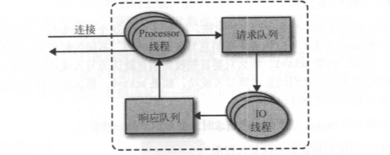
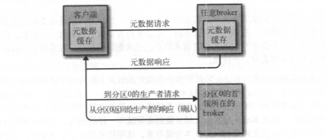
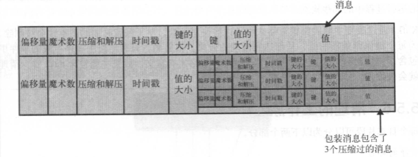

## 集群成员关系
Kafka使用Zookeeper来维护集群成员的信息。每个broker都有一个唯一标识符，这个标识符可以在配置文件里指定，也可以自动生成。在broker启动的时候，它通过创建临时节点把自己的ID注册到Zookeeper。Kafka组件订阅Zookeeper的/brokers/ids路径 (broker在Zookeeper上的注册路径），当有broker加入集群或退出集群时，这些组件就可以获得通知

&emsp;  
如果你要启动另一个具有相同ID的broker，会得到一个错误--新broker会试着进行注册，但不会成功，因为Zookeeper里已经有一个具有相同ID的 broker

&emsp;  
在broker停机、出现网络分区或长时间垃圾回收停顿时，broker会从Zookeeper上断开连接，此时broke在启动时创建的临时节点会自动从 Zookeeper上移除。监听broker列表的Kafka组件会被告知该broker已移除

&emsp;  
在关闭broker时，它对应的节点也会消失，不过它的ID会继续存在于其他数据结构中。例如，主题的副本列表里就可能包含这些ID。在完全关闭一个broker之后，如果使用相同的ID启动另一个全新的broker，它会立即加入集群，并拥有与旧broker相同的分区和主题

## 控制器
控制器其实就是一个broker，只不过它除了具有一般broker的功能之外，还负责分区首领的选举。集群里第一个启动的broker通过在Zookeeper里创建一个临时节点/controller让自己成为控制器。其他broker在启动时也会尝试创建这个节点，不过它们会收到一个"节点已存在"的异常，然后"意识"到控制器节点已存在，也就是说集群里已经有一个控制器了。其他broker在控制器节点上创建Zookeeper watch对象，这样它们就可以收到这个节点的变更通知。这种方式可以确保集群里一次只有一个控制器存在

&emsp;  
如果控制器被关闭或者与Zookeeper断开连接，Zookeeper上的临时节点就会消失。集群里的其他broker通过watch对象得到控制器节点消失的通知，它们会尝试让自己成为新的控制器。第一个在Zookeeper里成功创建控制器节点的broker就会成为新的控制器，其他 点会收到"节点已存在"的异常，然后在新的控制器节点上再次创建watch对象。每个新选出的控制器通过Zookeeper的条件递增操作获得一个全新的、数值更大的controller epoch。其他broker在知道当前controller epoch后，如果收到由控制器发出的包含较 epoch的消息，就会忽略它们

&emsp;  
当控制器发现一个broker已经离开集群它就知道，那些失去首领的分区需要一个新首领（这些分区的首领刚好是在这个broker上）。控制器遍历这些分区，并确定谁应该成为新首领（简单来说就是分区副本列表里的下一个副本），然后向所有包含新首领或现有跟随者的broker发送请求。该请求消息包含了谁是新首领以及谁是分区跟随者的信息。随后，新首领开始处理来自生产者和消费者的请求，而跟随者开始从新首领那里复制消息

&emsp;  
当控制器发现一个broker加入集群时，它会使用broker ID来检查新加入的broker是否包含现有分区的副本。如果有，控制器就把变更通知发送给新加入的broker和其他broker, 新broker上的副本开始从首领那里复制消息

&emsp;  
简而言之，Kafka使用Zookeeper的临时节点来选举控制器，并在节点加入集群或退出集群时通知控制器。控制器负责在节点加入或离开集群时进行分区首领选举。控制器使用epoch来避免"脑裂"

## 复制
Kafka使用主题来组织数据，每个主题被分为若干个分区，每个分区有多个副本。那些副本被保存在broker上，每个broker可以保存成百上千个属于不同主题和分区的副本

&emsp;  
副本有以下两种类型:
* 首领副本  
每个分区都有一个首领副本。为了保证一致性，所有生产者请求和消费者请求都会经过这个副本
* 跟随着副本  
首领以外的副本都是跟随者副本。跟随者副本不处理来自客户端的请求，它们唯一的任务就是从首领那里复制消息，保持与首领一致的状态。如果首领发生崩溃，其中的一个跟随者会被提升为新首领

&emsp;  
首领的另一个任务是搞清楚哪个跟随者的状态与自己是一致的。跟随者为了保持与首领的状态一致，在有新消息到达时尝试从首领那里复制消息，不过有各种原因会导致同步失败。为了与首领保持同步，跟随者向首领发送获取数据的请求，这种请求与悄费者为了读取消息而发送的请求是一样的。首领将响应消息发给跟随者。请求消息里包含了跟随者想要获取消息的偏移量，而且这些偏移量总是有序的

&emsp;  
一个跟随者副本先请求消息1 ，接着请求消息2，然后请求消息3，在收到这3个请求的响 应之前，它是不会发送第4个请求消息的。如果跟随者发送了请求消息4，那么首领就知道它已经收到了前面3个请求的响应。 通过查看每个跟随者请求的最新偏移量，首领就会知道每个跟随者复制的进度。如果跟随者在10s内没有请求任何消息，或者虽然在请求消息，但在10s内没有请求最新的数据，那么它就会被认为是不同步的。如果一个副本无法与首领保持一致，在首领发生失效时，它就不可能成为新首领--毕竟它没有包含全部的消息。相反，持续请求得到的最新消息副本被称为**同步的副本**。在首领发生失效时，只有同步副本才有可能被选为新首领

&emsp;  
跟随者的正常不活跃时间或在成为不同步副本之前的时间是通过replica.lag.time.max.ms参数来配置的。这个时间间隔直接影响着首领选举期间的客户端行为和数据保留机制。除了当前首领之外，每个分区都有一个首选首领创建主题时选定的首领就是分区的首选首领。之所以把它叫作首选首领，是因为在创建分区时，需要在broker之间均衡首领。因此，我们希望首选首领在成为真正的首领时，broker间的负载最终会得到均衡。默认情况下，Kafka的auto.leader.rebalance.enable被设为true，它会检查首选首领是不是当前首领，如果不是，并且该副本是同步的，那么就会触发首领选举，让首选首领成为当前首领

## 处理请求
broker的大部分工作是处理客户端、分区副本和控制器发送给分区首领的请求。Kafka提供了一个二进制协议（基于 TCP），指定了请求消息的格式以及broker如何对请求作出响应--包括成功处理请求或在处理请求过程中遇到错误。客户端发起连接并发送请求，broker处理请求井作出响应。broker按照请求到达的顺序来处理它们--这种顺序保证让Kafka具有了消息队列的特性，同时保证保存的消息也是有序的

&emsp;  
所有的请求消息都包含一个标准消息头：
* Request type (也就是 API key) 
* Request version (broker可以处理不同版本的客户端请求，并根据客户端版本作出不同的响应） 
* Correlation ID--一个具有唯一性的数字，用于标识请求消息，同时也会出现在响应消息和错误日志里（用于诊断问题） 
* Client ID--用于标识发送请求的客户端  

&emsp;  
broker会在它所监听的每一个端口上运行一个Acceptor线程，这个线程会创建一个连接，并把它交给Processor线程去处理。Processor线程（也被叫作"网络线程"）的数量是可配置的。网络线程负责从客户端获取请求消息，把它们放进请求队列，然后从响应队列获取响应消息

&emsp;  
请求消息被放到请求队列后，IO线程会负责处理它们。下面是几种最常见的请求类型：
* 生产请求  
生产者发送的请求，它包含客户端要写入broker的消息
* 获取请求  
在消费者和跟随者副本需要从broker读取消息时发送的请求

   
生产请求和获取请求都必须发送给分区的首领副本。如果broker收到一个针对特定分区的请求，而该分区的首领在另一个broker上，那么发送请求的客户端会收到一个"非分区首领"的错误响应。当针对特定分区的获取请求被发送到一个不含有该分区首领的broker上，也会出现同样的错误。Kafka客户端要自己负责把生产请求和获取请求发送到正确的broker上

&emsp;  
客户端使用了另一种请求类型，也就是元数据请求。这种请求包含了客户端感兴趣的主题列表。服务器端的响应消息里指明了这些主题所包含的分区、每个分区都有哪些副本，以及哪个副本是首领。元数据请求可以发送给任意一个broker，因为所有broker都缓存了这些信息

&emsp;  
一般情况下，客户端会把这些信息缓存起来，并直接往目标broker上发送生产请求和获取请求。它们需要时不时地通过发送元数据请求来刷新这些信息（刷新的时间间隔通过metadata.max.age.ms参数来配置），从而知道元数据是否发生了变更。另外，如果客户端收到"非首领"错误，它会在尝试重发请求之前先刷新元数据，因为这个错误说明了客户端正在使用过期的元数据信息，之前的请求被发到了错误的broker上  
  
 
### 生产请求
包含首领的broker在收到生产请求时，会对请求做一些验证：
* 发生数据的用户是否有写入主题的权限
* 请求里包含的acks是否有效
* 如果acks=all，是否有足够多的同步副本保证消息已经被安全写入

之后，消息被写入本地磁盘。在Linux系统上，消息会被写入文件系统缓存里，并不保证它何时会被刷新到磁盘上。Kafka不会一直等待数据被写到磁盘上--它依赖复制功能来保持消息的持久性。在消息被写入分区的首领之后，broker开始检查acks配置参数--如果acks被设为1或0，那么broker立即返回响应；如果acks被设为all，那么请求会被保存在一个叫做**炼狱**的缓冲区里，知道首领发现所有跟随者副本都复制了消息，响应才会返回给客户端

### 获取请求
broker处理获取请求的方式与处理生产请求的方式很相似，主要有以下几点不同：
* 首领在收到请求时，它会先检查请求是否有效，如果客户端请求的是已经被删除的数据，或者请求的偏移量不存在，那么broker将返回一个错误
* Kafka使用零复制技术向客户端发送消息--也就是说，Kafka直接把消息从文件（或者更确切地说是Linux文件系统缓存）里发送到网络通道，而不需要经过任何中间缓冲区。这项技术避免了字节复制，也不需要管理内存缓冲区，从而获得更好的性能
* 客户端可以设置broker返回数据的上限，也可以设置下限。前者避免在消息量较大的情况下耗尽客户端内存，后者在消息量较少的情况下减少消息发送次数。但是我们可以设置一个超时时间，如果在该时间内没有积累足够多的数据量，那么就返回当前数据量
* 并不是所有保存在分区首领上的数据都可以被客户端读取。大部分客户端只能读取已经被写入所有同步副本的消息，跟随者副本也不行

## 物理存储
### 分区分配
在创建主题时，Kafka首先会决定如何在broker间分配分区。假设你有6个broker，打算创建一个包含10个分区的主题，并且复制系数为3。那么Kafka就会有30个分区副本， 它们可以被分配给6个 broker。在进行分区分配时，我们要达到如下的目标：
* 在broker间平均地分布分区副本
* 确保每个分区的每个副本分布在不同的broker上
* 如果为broker指定了机架信息，那么尽可能把每个分区的副本分配到不同机架的broer上

### 文件管理
保留数据是Kafka的一个基本特性，Kafka不会一直保留数据，也不会等到所有消费者都读取了消息之后才删除消息。相反，Kafka管理员为每个主题配置了数据保留期限，规定数据被删除之前可以保留多长时间，或者清理数据之前可以保留的数据量大小

&emsp;  
因为在一个大文件里查找和删除消息是很费时的,也很容易出错，所以我们把分区分成若干个片段。默认情况下，每个片段包含lGB或一周的数据，以较小的那个为准。在broker往分区写入数据时，如果达到片段上限，就关闭当前文件，并打开一个新文件

&emsp;  
当前正在写入数据的片段叫作活跃片段。活动片段永远不会被删除，所以如果你要保留数据l天，但片段里包含了5天的数据，那么这些数据会被保留5天，因为在片段被关闭之前这些数据无法被删除。如果你要保留数据一周，而且每天使用一个新片段，那么你就会看到，每天在使用一个新片段的同时会删除一个最老的片段--所以大部分时间该分区会有7个片段存在 

### 文件格式
除了键、值和偏移量外，消息里还包含了消息大小、校验和、消息格式版本号、压缩算法 (Snappy、GZip或LZ4）和时间戳（在0.10.0版本里引入的）。时间戳可以是生产者发送消息的时间，也可以是消息到达broker的时间，这个是可配置的

&emsp;  
如果生产者发送的是压缩过的消息，那么同一个批次的消息会被压缩在一起，被当作"包装消息"进行发送。于是，broker就会收到一个这样的消息，然后再把它发送给消费者。消费者在解压这个消息之后，会看到整个批次的消息，它们都有自己的时间戳和偏移量  
  
也就是说，如果在生产者端使用了压缩功能（极力推荐），那么发送的批次越大，就意味着在网络传输和磁盘存储方面会获得越好的压缩性能，同时意味着如果修改了消费者使用的消息格式（例如，在消息里增加了时间戳），那么网络传输和磁盘存储的格式也要随之修改，而且broker要知道如何处理包含了两种消息格式的文件。Kafka附带了一个叫DumpLogSegment的工具，可以用它查看片段的内容。它可以显示每个消息的偏移量、校验和、魔术数字节、消息大小和压缩算法。运行该工具的方法如下：
```
bin/kafka-run-class.sh kafka.tools.DumpLogSegment
```
如果使用了--deep-iteration参数，可以显示被压缩到包装消息里的消息

### 索引
消费者可以从Kafka的任意可用偏移量位置开始读取消息。假设消费者要读取从偏移量100开始的lMB消息，那么broker必须立即定位到偏移量100（可能是在分区的任意一个片段里），然后开始从这个位置读取消息。为了帮助broker更快地定位到指定的偏移量，Kafka为每个分区维护了一个索引。索引把偏移量映射到片段文件和偏移量在文件里的位置

&emsp;  
索引也被分成片段，所以在删除消息时，也可以删除相应的索引。Kafka不维护索引的校验和。如果索引出现损坏，Kafka会通过重新读取消息并录制偏移量和位置来重新生成索引。如果有必要，管理员可以删除索引，这样做是绝对安全的，Kafka会自动重新生成这些索引

### 清理
Kafka可以通过改变主题的保留策略来为每个键保留最新的值，早于保留时间的旧事件会被删除，从而达到清理的效果。很显然，只有当应用程序生成的事件里包含了键值对时，为这些主题设置compact策略才有意义。如果主题包含null键， 清理就会失败


